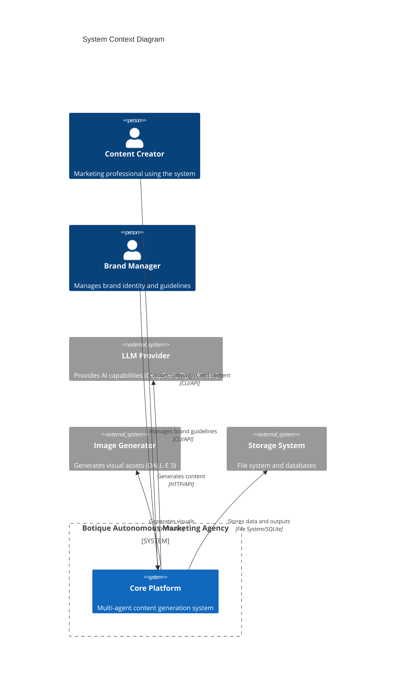
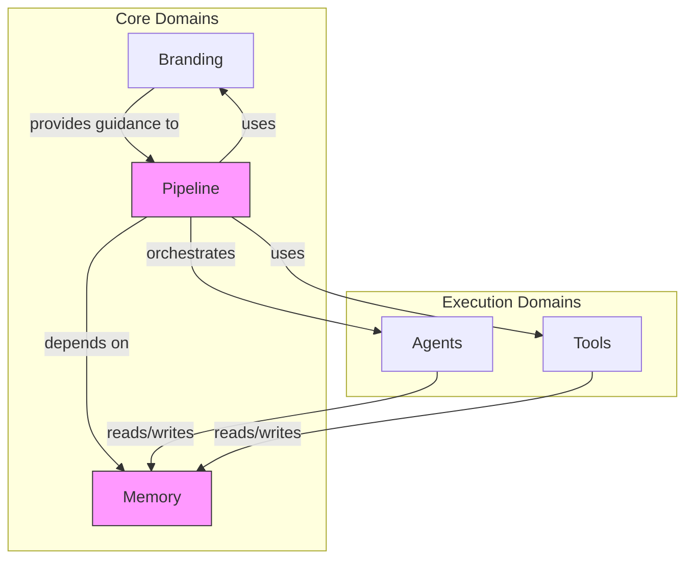

# System Architecture Overview

> **Document Type**: Root Architecture Document (Level 1 - Context)
> **Last Updated**: 2026-01-27
> **Version**: 1.0

## Document Map

This is the entry point for all architecture documentation. For complex systems, architecture is documented hierarchically. Start here and navigate to domain-specific documents as needed.

```
ARCHITECTURE.md (You are here)
│
├── domains/
│   ├── branding/ARCHITECTURE.md      → Brand identity, audience profiles, visual libraries
│   ├── pipeline/ARCHITECTURE.md      → 5-phase content generation pipeline
│   ├── agents/ARCHITECTURE.md        → AI agent architecture and orchestration
│   ├── memory/ARCHITECTURE.md        → Coherence Brief system (key architectural component)
│   └── tools/ARCHITECTURE.md         → Code-based tools for logic and consistency
│
└── cross-cutting/
    └── data-models/ARCHITECTURE.md   → Data structure standards and JSON schemas
```

> **AI Instruction**: When working on a specific domain, load the corresponding domain architecture document for detailed context. This root document provides system-wide context only.

## System Purpose

Botique is a **full autonomous marketing agency** that builds complete campaigns and independent content from scratch using a Multi-Agent AI system. The system follows branding guidelines, editorial standards, and all the strategic elements that a traditional marketing agency would use and build, but implemented autonomously.

The system transforms source materials (articles, briefs, strategic inputs) into high-quality marketing content including social media posts, campaigns, and brand-aligned creative assets. It operates through a sophisticated 5-phase pipeline that orchestrates specialized AI agents and code-based tools to ensure consistency, quality, and brand alignment throughout the content generation process.

Key capabilities include:
- **Strategic Branding**: Audience profiling, brand identity management, visual libraries
- **Content Ideation**: Multi-idea generation from source materials with per-post configuration
- **Narrative Architecture**: Structured storytelling with template-based copy generation
- **Visual Composition**: Automated design generation with brand-aligned visual assets
- **Campaign Orchestration**: End-to-end campaign creation from strategy to execution

The system serves marketing professionals, content creators, and brand managers who need to scale high-quality, brand-consistent content production while maintaining strategic alignment and creative excellence.

## System Context Diagram



## Domain Overview

The system is organized into the following bounded contexts. Each domain is autonomous and owns its data. Cross-domain communication happens through well-defined contracts.

| Domain | Responsibility | Documentation |
|--------|---------------|---------------|
| **Branding** | Brand identity, audience profiles, visual libraries, editorial guidelines | [→ Architecture](./domains/branding/ARCHITECTURE.md) |
| **Pipeline** | 5-phase content generation pipeline for campaigns and content | [→ Architecture](./domains/pipeline/ARCHITECTURE.md) |
| **Agents** | AI agent architecture (Post Ideator, Narrative Architect, Copywriter, Visual Composer, Caption Writer) | [→ Architecture](./domains/agents/ARCHITECTURE.md) |
| **Memory** | Coherence Brief system - key architectural component for maintaining consistency and context across all operations | [→ Architecture](./domains/memory/ARCHITECTURE.md) |
| **Tools** | Code-based tools for logic, consistency, and orchestration | [→ Architecture](./domains/tools/ARCHITECTURE.md) |

### Domain Relationships



## Cross-Cutting Concerns

Architectural aspects that span all domains and must be consistently applied.

| Concern | Description | Documentation |
|---------|-------------|---------------|
| **Data Models** | JSON schema definitions, data structure standards, validation requirements | [→ Architecture](./cross-cutting/data-models/ARCHITECTURE.md) |

## System-Wide Principles

These principles apply across all domains. Domain-specific principles may extend but not contradict these.

### Principle 1: Code Decides, AI Creates

Code handles logic, consistency, and deterministic decisions. AI agents handle creative content generation. This separation ensures predictable behavior while maintaining creative quality.

**Application**: 
- Code selects palettes, typography, layouts based on rules
- Code orchestrates pipeline phases and validates outputs
- AI generates ideas, narratives, copy, and visual descriptions

### Principle 2: Coherence Brief as Foundation

The Coherence Brief is the central memory mechanism that ensures consistency per-post and per-campaign. It evolves through pipeline phases, accumulating context and decisions.

**Application**:
- Brief created in Phase 2 with high-level strategy
- Enriched incrementally by each subsequent phase
- All agents read from and write to the brief
- Ensures brand alignment and narrative consistency

### Principle 3: Template-Based Narrative System

Content follows a structured template hierarchy with semantic selection. This ensures consistent quality while maintaining creative flexibility.

**Application**:
- High-level template types (hook, value, CTA, transition)
- Semantic template selection (91% accuracy)
- Template-guided copy generation
- Brand-aligned narrative structures

### Principle 4: Branding as Guide, Not Override

Branding provides strategic guidance and defaults, but never overrides explicit user definitions. User-defined parameters take precedence over brand defaults.

**Application**:
- Branding suggests platform, tone, persona based on audience
- User can override any branding suggestion
- Branding enriches but doesn't constrain user intent

### Principle 5: Single Responsibility Agents

Each AI agent has one clear responsibility. Prompts are specialized for specific tasks, not general-purpose.

**Application**:
- Post Ideator: Generate ideas only
- Narrative Architect: Create narrative structure only
- Copywriter: Write copy only
- Visual Composer: Generate visual descriptions only
- Caption Writer: Write captions only

## Technology Radar

Current technology choices and their status across the organization.

| Category | Adopt | Trial | Assess | Hold |
|----------|-------|-------|--------|------|
| Languages | Python | - | - | - |
| LLM Providers | DeepSeek, OpenAI | - | Anthropic | - |
| Databases | SQLite | PostgreSQL | - | - |
| Image Generation | DALL-E 3 | - | Midjourney, Stable Diffusion | - |
| Template Matching | Sentence Transformers | - | - | Keyword-only |

## Navigation Guide for AI Assistants

> **AI Instruction**: Use this guide to determine which documents to consult.

**For feature implementation**:
1. Identify which domain owns the feature
2. Load that domain's ARCHITECTURE.md
3. Check memory domain if context/consistency is involved
4. Check data-models if data structures are affected

**For pipeline changes**:
1. Load domains/pipeline/ARCHITECTURE.md
2. Check domains/agents/ARCHITECTURE.md if agent behavior changes
3. Check domains/tools/ARCHITECTURE.md if tool logic changes
4. Check domains/memory/ARCHITECTURE.md if context handling changes

**For branding changes**:
1. Load domains/branding/ARCHITECTURE.md
2. Check how branding integrates with pipeline
3. Verify data model compatibility

**For memory/context changes**:
1. Load domains/memory/ARCHITECTURE.md (key architectural component)
2. Check integration points with all other domains
3. Verify brief evolution through pipeline phases

**For data model changes**:
1. Load cross-cutting/data-models/ARCHITECTURE.md
2. Check affected domains for compatibility
3. Verify validation requirements

## Quick Reference

### Key Metrics

| Metric | Target | Owner |
|--------|--------|-------|
| Template Selection Accuracy | 91% | Tools Domain |
| Content Quality Score | > 8.0/10 | Pipeline Domain |
| Brand Alignment | 100% | Branding Domain |
| Pipeline Completion Rate | > 95% | Pipeline Domain |

### Critical Paths

1. **Content Generation**: Article → Ideation → Configuration → Narrative → Copy/Visual → Finalization
2. **Brand Alignment**: Branding → Pipeline → All Phases → Output
3. **Context Management**: Memory → All Agents → Consistency

## Related Documents

- [ADR Index](./decisions/README.md) - All architectural decisions
- [RFC Index](./proposals/README.md) - Change proposals
- [Changelog](./evolution/CHANGELOG.md) - Architecture evolution history
