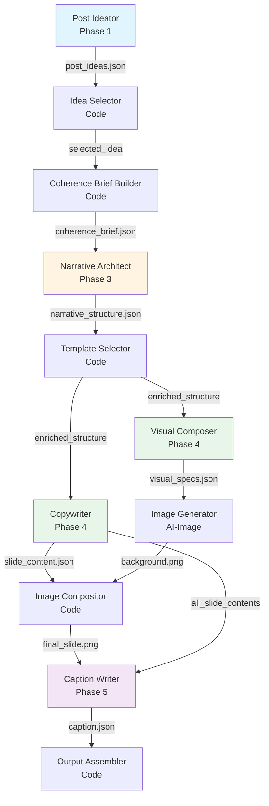

# Arquitetura: Agentes AI

> **Versão**: 2.1  
> **Data**: 2026-01-14  
> **Status**: Documentação de Agentes  
> **Autor**: Sistema de Documentação Automatizada

---

## Visão Geral

O pipeline utiliza **5 agentes especializados em LLM** que trabalham em sequência para gerar posts de mídia social. Cada agente tem uma responsabilidade única e bem definida, seguindo o princípio de **Single Responsibility**.

### Princípio Fundamental

**Cada agente AI executa UMA tarefa específica** com prompts especializados. O código orquestra a lógica e decisões; os agentes AI geram conteúdo criativo.

---

## Agentes do Pipeline

### 1. Post Ideator (Phase 1)

**Responsabilidade**: Analisar artigo e gerar 3-6 ideias de posts com configurações por post.

**Localização**: `src/phases/phase1_ideation.py`

**Inputs**:
- `article.txt` (artigo completo)
- Configuração de ideation (número de ideias, filtros)

**Outputs**:
- `post_ideas.json` com:
  - Lista de ideias (cada uma com: `platform`, `tone`, `persona`, `angle`, `hook`, `narrative_arc`, `estimated_slides`)
  - `article_summary` (resumo do artigo com insights chave)

**Prompt**: `prompts/post_ideator.md`

**Características**:
- ✅ Gera múltiplas ideias por artigo
- ✅ Define configurações por post (platform, tone, persona)
- ✅ Extrai insights chave do artigo
- ✅ Estima número de slides por ideia

**Exemplo de Output**:
```json
{
  "ideas": [
    {
      "id": "idea_1",
      "platform": "linkedin",
      "tone": "professional",
      "persona": "C-level execs",
      "angle": "AI failure patterns",
      "hook": "85% of AI projects fail—here's why",
      "narrative_arc": "Hook → Problem → Solution → CTA",
      "estimated_slides": 7,
      "confidence": 0.9
    }
  ],
  "article_summary": {
    "main_thesis": "Organizational alignment is key to AI success",
    "key_insights": [
      {"id": "insight_1", "content": "85% of AI projects fail...", "type": "statistic", "strength": 10}
    ]
  }
}
```

**Contexto Usado**: Nenhum (primeiro agente, não usa Coherence Brief)

---

### 2. Narrative Architect (Phase 3)

**Responsabilidade**: Criar estrutura narrativa detalhada slide-por-slide com `template_type` e `value_subtype`.

**Localização**: `src/narrative/architect.py`

**Inputs**:
- `coherence_brief.json` (brief inicial da Phase 1)
- `article.txt` (artigo completo)
- Versão opcional do prompt

**Outputs**:
- `narrative_structure.json` com:
  - `pacing` (fast/moderate/deliberate)
  - `transition_style` (abrupt/smooth/dramatic)
  - `arc_refined` (arco narrativo refinado)
  - `slides[]` (cada slide com: `template_type`, `value_subtype`, `purpose`, `copy_direction`, `target_emotions`, `content_slots`)
  - `rationale` (justificativa das decisões)

**Prompt**: `prompts/narrative_architect.md`

**Características**:
- ✅ Define `template_type` por slide (`hook`, `value`, `cta`, `transition`)
- ✅ Define `value_subtype` para slides de valor (`data`, `insight`, `solution`, `example`)
- ✅ Fornece `copy_direction` detalhada (50-300 palavras) para guiar template selection
- ✅ Enriquece o Coherence Brief com estrutura narrativa

**Método de Contexto**: `brief.to_narrative_architect_context()`

**Campos do Brief Usados**:
- `voice` (tone, personality, vocabulary, formality)
- `emotions` (primary, secondary, avoid)
- `content` (keywords, themes, main_message, angle, hook)
- `structure` (objective, narrative_arc alto nível, estimated_slides)
- `key_insights_content` (insights completos)

**Exemplo de Output**:
```json
{
  "narrative_pacing": "moderate",
  "transition_style": "smooth",
  "arc_refined": "Hook → Problem → Value → CTA",
  "slides": [
    {
      "slide_number": 1,
      "template_type": "hook",
      "value_subtype": null,
      "purpose": "Grab attention with stat",
      "target_emotions": ["shock"],
      "copy_direction": "Open with contrast highlighting gap between certificates and actual skills...",
      "key_elements": ["certificates", "skills"],
      "content_slots": {"headline": {"max_chars": 60}}
    },
    {
      "slide_number": 2,
      "template_type": "value",
      "value_subtype": "data",
      "purpose": "Present quantified evidence",
      "target_emotions": ["recognition"]
    }
  ]
}
```

**Enriquecimento do Brief**: 
- Chama `brief.enrich_from_narrative_structure(narrative_structure)`
- Adiciona: `narrative_structure`, `narrative_pacing`, `transition_style`, `arc_refined`, `narrative_rationale`

---

### 3. Copywriter (Phase 4)

**Responsabilidade**: Gerar texto para todos os slides seguindo estruturas de templates.

**Localização**: `src/copywriting/writer.py`

**Inputs**:
- `coherence_brief.json` (com `narrative_structure` enriquecido)
- `slides_info[]` (estrutura narrativa com `template_id` já selecionado)
- `article.txt` (artigo completo)
- `templates_reference` (estruturas detalhadas dos templates selecionados)

**Outputs**:
- `slide_content.json` com texto para todos os slides:
  - `title` (com `content` e `emphasis[]`)
  - `subtitle` (opcional)
  - `body` (opcional)
- Enriquece brief com `copy_guidelines` e `cta_guidelines`

**Prompt**: `prompts/copywriter.md`

**Características**:
- ✅ Gera texto para TODOS os slides em uma única chamada LLM (garante coerência)
- ✅ Segue estruturas de templates (`structure` field do template)
- ✅ Preenche placeholders com conteúdo contextual
- ✅ Respeita `length_range` e `tone` dos templates
- ✅ Mantém fluxo narrativo entre slides

**Método de Contexto**: `brief.to_copywriter_context()`

**Campos do Brief Usados**:
- `voice` (tone, personality, vocabulary, formality)
- `content` (main_message, keywords, angle, hook)
- `audience` (persona, pain_points, desires)
- `narrative_structure` (estrutura detalhada com `template_id` por slide)
- `key_insights_content` (insights completos)

**Exemplo de Output**:
```json
{
  "slides": [
    {
      "slide_number": 1,
      "title": {
        "content": "Certificados acumulam poeira. Suas habilidades não.",
        "emphasis": ["certificados", "habilidades"]
      }
    },
    {
      "slide_number": 2,
      "title": {
        "content": "85% das empresas falham em IA – McKinsey",
        "emphasis": ["85%", "IA", "McKinsey"]
      }
    }
  ]
}
```

**Enriquecimento do Brief**:
- Chama `brief.enrich_from_copywriting(copy_guidelines)`
- Adiciona: `copy_guidelines` (headline_style, body_style)
- Adiciona: `cta_guidelines` (type, tone, suggested_text)

---

### 4. Visual Composer (Phase 4)

**Responsabilidade**: Gerar especificações visuais (design) para slides, SEM texto.

**Localização**: `src/visual/composer.py` (assumido)

**Inputs**:
- `coherence_brief.json` (com `narrative_structure`)
- `slide_layout` (layout atribuído)
- `post_config.json` (configuração do post)

**Outputs**:
- `visual_specs.json` por slide:
  - `background` (tipo, cores, gradientes)
  - `elements[]` (elementos visuais: glows, shapes, etc.)
  - Enriquece brief com `visual_preferences`

**Prompt**: `prompts/visual_composer.md` (assumido)

**Características**:
- ✅ Gera design SEM texto (texto é adicionado depois pelo Image Compositor)
- ✅ Segue paleta e tipografia do brief
- ✅ Respeita emoções e mood do brief
- ✅ Considera pacing e transitions da estrutura narrativa

**Método de Contexto**: `brief.to_visual_composer_context()`

**Campos do Brief Usados**:
- `visual` (palette, typography, canvas, style, mood)
- `emotions` (primary, secondary, avoid)
- `narrative_structure` (pacing, transitions)
- `brand` (values, assets)

**Exemplo de Output**:
```json
{
  "slide_number": 1,
  "background": {
    "type": "gradient",
    "colors": ["#1A1A2E", "#0A0A0A"]
  },
  "elements": [
    {
      "type": "glow",
      "position": {"x": 540, "y": 580},
      "color": "#0060FF",
      "intensity": 0.7
    }
  ]
}
```

**Enriquecimento do Brief**:
- Chama `brief.enrich_from_visual_composition(visual_preferences)`
- Adiciona: `visual_preferences` (layout_style, text_hierarchy, element_density)

---

### 5. Caption Writer (Phase 5)

**Responsabilidade**: Escrever legenda específica da plataforma para o post completo.

**Localização**: `src/caption/writer.py` (assumido)

**Inputs**:
- `coherence_brief.json` (brief completo com todas as fases)
- `all_slide_contents[]` (conteúdo de todos os slides)
- `post_config.json` (configuração do post)

**Outputs**:
- `caption.json`:
  - `platform` (plataforma alvo)
  - `full_caption` (legenda completa)
  - `character_count` (contagem de caracteres)
  - `hashtags[]` (hashtags sugeridas)
- Enriquece brief com `platform_constraints`

**Prompt**: `prompts/caption_writer.md` (assumido)

**Características**:
- ✅ Gera legenda específica da plataforma (LinkedIn, Instagram, etc.)
- ✅ Respeita limites de caracteres da plataforma
- ✅ Inclui hashtags apropriadas
- ✅ Usa CTA guidelines do Copywriter
- ✅ Mantém voice e tone do brief

**Método de Contexto**: `brief.to_caption_writer_context()`

**Campos do Brief Usados**:
- `voice` (tone, formality, vocabulary)
- `platform` (plataforma alvo)
- `cta_guidelines` (do Copywriter)
- `platform_constraints` (se já existir)
- `brand` (handle, values)
- `content` (main_message, keywords)

**Exemplo de Output**:
```json
{
  "platform": "linkedin",
  "full_caption": "85% of AI projects fail—but it's not the tech's fault...",
  "character_count": 1247,
  "hashtags": ["#AI", "#Leadership", "#DigitalTransformation"]
}
```

**Enriquecimento do Brief**:
- Chama `brief.enrich_from_caption_writing(platform_constraints)`
- Adiciona: `platform_constraints` (max_caption_length, hashtag_count, cta_format, mention_style)

---

## Fluxo de Execução dos Agentes



---

## Princípios de Design dos Agentes

### 1. Single Responsibility

Cada agente tem UMA responsabilidade clara:
- **Post Ideator**: Ideias e análise
- **Narrative Architect**: Estrutura narrativa
- **Copywriter**: Texto
- **Visual Composer**: Design
- **Caption Writer**: Legenda

### 2. Contexto Especializado

Cada agente recebe apenas o contexto necessário via métodos específicos:
- `to_narrative_architect_context()` → Apenas voice, emotions, content, structure
- `to_copywriter_context()` → Voice, content, audience, narrative_structure
- `to_visual_composer_context()` → Visual, emotions, narrative_structure
- `to_caption_writer_context()` → Voice, platform, CTA guidelines

### 3. Enriquecimento Incremental

Cada agente enriquece o Coherence Brief com suas decisões:
- **Narrative Architect** → `narrative_structure`, `pacing`, `transition_style`
- **Copywriter** → `copy_guidelines`, `cta_guidelines`
- **Visual Composer** → `visual_preferences`
- **Caption Writer** → `platform_constraints`

### 4. Validação e Retry

Cada agente valida seu output:
- **Post Ideator**: ≥3 ideias? Distintas?
- **Narrative Architect**: ≥5 slides? Arc lógico? Todos têm `template_type`?
- **Copywriter**: Texto dentro dos limites? Segue estrutura do template?
- **Visual Composer**: Design sem texto? Dimensões corretas?
- **Caption Writer**: Tamanho OK? Score >0.7?

Retry: 2 tentativas com feedback; fallback para defaults.

---

## Integração com Templates

### Narrative Architect + Template Selector + Copywriter

1. **Narrative Architect** define `template_type` e `value_subtype` (estratégia)
2. **Template Selector** (código) seleciona `template_id` específico via análise semântica
3. **Copywriter** usa estrutura do template (`structure` field) para gerar texto

**Exemplo**:
```python
# Narrative Architect output
slide = {
    "template_type": "value",
    "value_subtype": "data",
    "purpose": "Present quantified evidence",
    "copy_direction": "Show statistics with credible source..."
}

# Template Selector seleciona
template_id = "VD_FONTE"  # "[Dado] – [Fonte]"

# Copywriter usa estrutura
template = library.get_template("VD_FONTE")
# template.structure = "[Dado] – [Fonte]"
# Copywriter gera: "85% das empresas falham – McKinsey"
```

---

## Performance e Custos

**Estimativas por post (7 slides)**:
- **Post Ideator**: ~1 chamada, ~2500 tokens in, ~800 tokens out
- **Narrative Architect**: ~1 chamada, ~2000 tokens in, ~1500 tokens out
- **Copywriter**: ~1 chamada, ~3000 tokens in, ~2000 tokens out
- **Visual Composer**: ~7 chamadas (1 por slide), ~500 tokens in, ~200 tokens out cada
- **Caption Writer**: ~1 chamada, ~1500 tokens in, ~500 tokens out

**Total**: ~15 chamadas LLM, ~12k tokens, ~$0.50 por post

---

## Referências

- **Código dos Agentes**:
  - `src/phases/phase1_ideation.py` - Post Ideator
  - `src/narrative/architect.py` - Narrative Architect
  - `src/copywriting/writer.py` - Copywriter
  - `src/visual/composer.py` - Visual Composer (assumido)
  - `src/caption/writer.py` - Caption Writer (assumido)

- **Prompts**:
  - `prompts/post_ideator.md`
  - `prompts/narrative_architect.md`
  - `prompts/copywriter.md`
  - `prompts/visual_composer.md` (assumido)
  - `prompts/caption_writer.md` (assumido)

- **Documentação Relacionada**:
  - `docs/architecture/tools.md` - Ferramentas de código
  - `docs/architecture/memory_management.md` - Coherence Brief
  - `docs/architecture/data_structures.md` - Estruturas de dados
