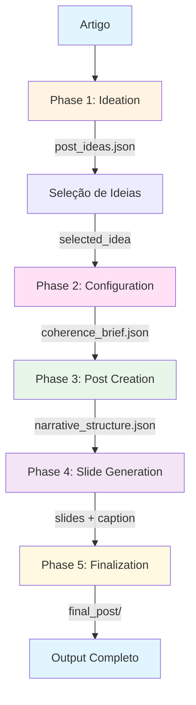

# Arquitetura: Visão Geral do Pipeline

> **Versão**: 2.1  
> **Data**: 2026-01-14  
> **Status**: Visão Geral Simplificada  
> **Autor**: Sistema de Documentação Automatizada

---

## Visão Geral

Pipeline simplificado de 5 fases para gerar posts de mídia social a partir de artigos. Cada fase tem responsabilidades claras e bem definidas.

### Objetivo

Gerar múltiplos posts de alta qualidade a partir de um único artigo, cada post com sua própria configuração (plataforma, tom, persona) e 1-12 slides + legenda.

---

## Fluxo do Pipeline



---

## Fases do Pipeline

### Phase 1: Ideation

**Objetivo**: Analisar artigo e gerar 3-6 ideias de posts.

**Agente**: Post Ideator (AI)

**Inputs**:
- `article.txt`

**Outputs**:
- `post_ideas.json` (ideias + resumo do artigo)

**Processo**:
1. Analisa artigo completo
2. Extrai insights chave
3. Gera 3-6 ideias com configurações por post (platform, tone, persona)
4. Estima número de slides por ideia

**Validação**:
- ≥3 ideias geradas?
- Ideias distintas?

---

### Phase 2: Configuration

**Objetivo**: Construir brief inicial de coerência e resolver parâmetros do post.

**Ferramentas**: Coherence Brief Builder + Parameter Resolver (Code)

**Inputs**:
- `selected_idea` (ideia selecionada)
- `article_summary` (do Phase 1)
- `libraries/` (paletas, tipografia, layouts)

**Outputs**:
- `coherence_brief.json` (brief inicial)
- `post_config.json` (configuração do post)

**Processo**:
1. Extrai campos da ideia (platform, tone, persona, etc.)
2. Seleciona paleta baseado em platform + tone
3. Seleciona tipografia baseado em platform + tone
4. Define canvas baseado em platform
5. Filtra insights usados
6. Constrói brief inicial com todos os campos de alto nível

**Validação**:
- Brief válido? (campos obrigatórios presentes)
- Config completo?

---

### Phase 3: Post Creation

**Objetivo**: Criar estrutura narrativa detalhada slide-por-slide.

**Agente**: Narrative Architect (AI)  
**Ferramenta**: Template Selector (Code)

**Inputs**:
- `coherence_brief.json` (brief inicial)
- `article.txt`

**Outputs**:
- `narrative_structure.json` (estrutura com `template_type` e `value_subtype`)
- `narrative_structure_enriched.json` (com `template_id` por slide)

**Processo**:
1. Narrative Architect gera estrutura narrativa:
   - Define `template_type` por slide (hook, value, cta, transition)
   - Define `value_subtype` para slides de valor (data, insight, solution, example)
   - Fornece `copy_direction` detalhada (50-300 palavras)
   - Define `purpose`, `target_emotions`, `content_slots`
2. Template Selector seleciona `template_id` específico:
   - Usa análise semântica (embeddings) para comparar slide description com templates
   - Seleciona melhor match baseado em cosine similarity
   - Adiciona `template_id`, `justification`, `confidence` a cada slide
3. Layout Resolver atribui layouts por slide
4. Enriquece brief com estrutura narrativa

**Validação**:
- ≥5 slides? (ou 1 para single_image)
- Arc lógico?
- Todos os slides têm `template_type`?
- Slides de valor têm `value_subtype`?
- Todos os slides têm `template_id`? (após Template Selector)
- Confidence >0.5? (após Template Selector)

---

### Phase 4: Slide Generation

**Objetivo**: Gerar conteúdo (texto + visual) para cada slide.

**Agentes**: Copywriter (AI) + Visual Composer (AI)  
**Ferramentas**: Prompt Builders + Image Generator + Image Compositor (Code)

**Inputs**:
- `narrative_structure_enriched.json` (estrutura com `template_id`)
- `coherence_brief.json` (com `narrative_structure`)
- `article.txt`
- `templates_reference` (estruturas detalhadas dos templates)

**Outputs**:
- `slide_content.json` (texto para todos os slides)
- `visual_specs.json` (design por slide)
- `final_slide.png` (slide completo por slide)

**Processo**:
1. **Copywriter** gera texto para TODOS os slides em uma chamada:
   - Usa estruturas de templates (`structure` field)
   - Preenche placeholders com conteúdo contextual
   - Respeita `length_range` e `tone` dos templates
   - Mantém fluxo narrativo
2. **Visual Composer** gera design por slide:
   - Gera background e elementos visuais
   - **NÃO inclui texto** (texto é adicionado depois)
   - Segue paleta e tipografia do brief
3. **Prompt Builder (Image)** constrói prompt para AI de imagem
4. **Image Generator** gera `background.png`
5. **Prompt Builder (Text)** constrói especificações de renderização de texto
6. **Image Compositor** combina tudo:
   - Carrega background
   - Renderiza elementos visuais
   - Renderiza texto com tipografia e cores
   - Aplica ênfase (cores diferentes)
   - Adiciona brand assets
   - Salva `final_slide.png`

**Validação**:
- Texto dentro dos limites?
- Texto segue estrutura do template?
- Design sem texto?
- Dimensões corretas?
- Texto legível?

---

### Phase 5: Finalization

**Objetivo**: Escrever legenda e validar qualidade.

**Agente**: Caption Writer (AI)  
**Ferramentas**: Output Assembler + Quality Validator (Code)

**Inputs**:
- `coherence_brief.json` (brief completo)
- `all_slide_contents[]` (conteúdo de todos os slides)
- `post_config.json`

**Outputs**:
- `caption.json` (legenda da plataforma)
- `/output/post_xxx/` (diretório completo)
- `validation_report.json` (relatório de validação)

**Processo**:
1. **Caption Writer** escreve legenda:
   - Gera legenda específica da plataforma
   - Respeita limites de caracteres
   - Inclui hashtags apropriadas
   - Usa CTA guidelines do Copywriter
2. **Output Assembler** empacota tudo:
   - Organiza slides em diretório
   - Inclui caption, brief, config
3. **Quality Validator** valida e pontua:
   - Verifica coerência (texto segue brief? visual segue paleta?)
   - Verifica completude (todos os slides? caption presente?)
   - Verifica qualidade visual (dimensões? texto legível?)
   - Verifica qualidade textual (texto dentro dos limites? segue templates?)
   - Gera score geral e breakdown

**Validação**:
- Tamanho da legenda OK?
- Score >0.7?

---

## Princípios de Design

### 1. Single Responsibility

Cada componente (agente ou ferramenta) tem UMA responsabilidade clara.

### 2. Code Decides, AI Creates

- **Código decide**: Consistência, lógica, seleções baseadas em regras
- **AI cria**: Conteúdo criativo (ideias, texto, design, legenda)

### 3. Per-Post Context

Cada post tem seu próprio contexto (platform, tone, persona) desde a ideation. Não há suposições globais.

### 4. Coherence Through Constraint

- **Coherence Brief**: Documento evolutivo que garante consistência
- **Libraries**: LLM seleciona de opções, não inventa
- **Gates**: Validação antes de avançar

### 5. Graceful Defaults

Input mínimo: apenas artigo. Sistema auto-sugere/atribui parâmetros por post.

---

## Componentes Principais

### Agentes AI (5)
1. **Post Ideator** - Gera ideias de posts
2. **Narrative Architect** - Cria estrutura narrativa
3. **Copywriter** - Gera texto
4. **Visual Composer** - Gera design
5. **Caption Writer** - Escreve legenda

### Ferramentas de Código (11)
1. **Idea Selector** - Filtra ideias
2. **Coherence Brief Builder** - Constrói brief inicial
3. **Parameter Resolver** - Resolve parâmetros
4. **Template Selector** - Seleciona templates via análise semântica
5. **Layout Resolver** - Atribui layouts
6. **Prompt Builder (Image)** - Constrói prompt de imagem
7. **Image Generator** - Gera background
8. **Prompt Builder (Text)** - Constrói especificações de texto
9. **Image Compositor** - Combina elementos
10. **Output Assembler** - Empacota outputs
11. **Quality Validator** - Valida e pontua

### Mecanismos de Memória
- **Coherence Brief**: Documento evolutivo que garante consistência

### Libraries
- **Palettes** - Paletas de cores pré-validadas
- **Typography** - Configurações de tipografia
- **Layouts** - Layouts pré-definidos
- **Templates** - 46 templates textuais pré-definidos

---

## Performance e Custos

**Por post (7 slides)**:
- **Chamadas LLM**: ~15 chamadas
- **Tokens**: ~12k tokens
- **Custo**: ~$0.50

**Tempo**:
- **Template Selection**: ~700ms (com embeddings) ou ~35ms (fallback)
- **Geração completa**: ~2-3 minutos (dependendo de API de imagem)

**Paralelização**:
- Posts independentes podem ser gerados em paralelo
- Slides podem ser gerados em paralelo (dentro de um post)

---

## Estrutura de Output

```
output/
  post_001/
    slides/
      slide_01.png
      slide_02.png
      ...
      slide_07.png
    caption.json
    coherence_brief.json
    post_config.json
    narrative_structure.json
    validation_report.json
```

---

## Documentação Detalhada

Para mais detalhes sobre componentes específicos:

- **Agentes**: `docs/architecture/agents.md`
- **Ferramentas**: `docs/architecture/tools.md`
- **Memória**: `docs/architecture/memory_management.md`
- **Estruturas de Dados**: `docs/architecture/data_structures.md`

---

## Referências

- **Código Principal**:
  - `generate_full_pipeline_production.py` - Pipeline completo
  - `src/orchestrator.py` - Orquestrador
  - `src/phases/` - Implementações das fases

- **Documentação Relacionada**:
  - `docs/architecture/agents.md` - Agentes detalhados
  - `docs/architecture/tools.md` - Ferramentas detalhadas
  - `docs/architecture/memory_management.md` - Coherence Brief
  - `docs/architecture/data_structures.md` - Estruturas de dados
  - `docs/SEMANTIC_TEMPLATE_SELECTION.md` - Seleção semântica de templates
