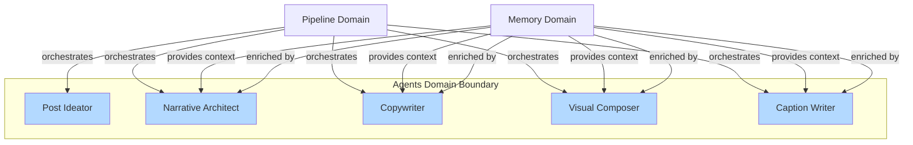
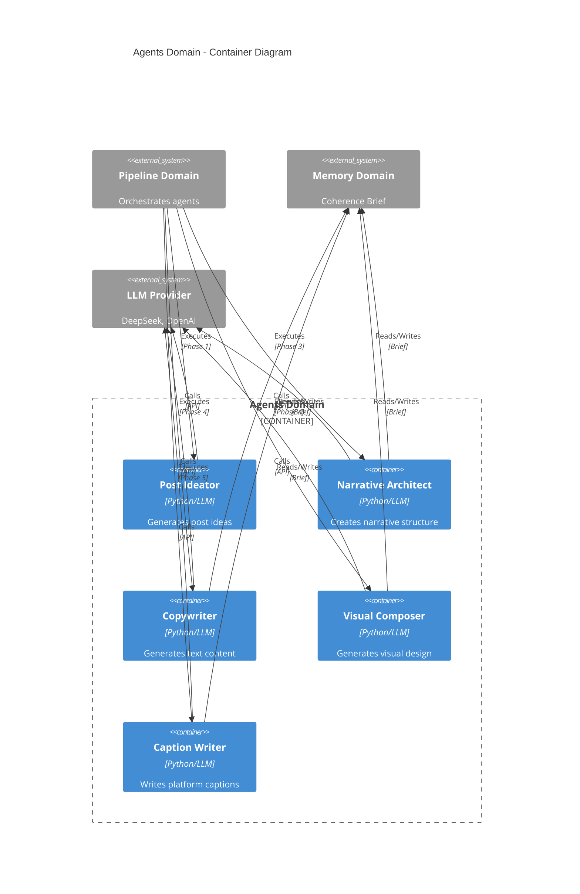
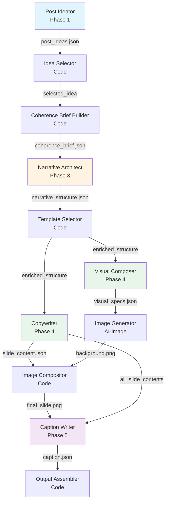

# Agents Domain Architecture

> **Document Type**: Domain Architecture Document (Level 2 - Container)
> **Parent**: [System Architecture](../../ARCHITECTURE.md)
> **Last Updated**: 2026-01-27
> **Version**: 1.0

## Document Scope

This document describes the architecture of the **Agents** bounded context. For system-wide context and principles, see the [root architecture document](../../ARCHITECTURE.md).

### What This Document Covers

- Internal structure of the Agents domain
- 5 specialized AI agents with single responsibility
- Agent communication patterns and context usage
- Integration with pipeline phases and memory domain

### What This Document Does NOT Cover

- Pipeline orchestration (see [Pipeline Domain](../pipeline/ARCHITECTURE.md))
- Code-based tools (see [Tools Domain](../tools/ARCHITECTURE.md))
- Coherence Brief structure (see [Memory Domain](../memory/ARCHITECTURE.md))

## Domain Overview

### Business Capability

The Agents domain provides specialized AI agents that generate creative content throughout the content generation pipeline. Each agent has a single, well-defined responsibility and uses specialized prompts to produce high-quality, brand-aligned content.

**What would happen if this domain didn't exist?**
- No AI-powered content generation
- Manual content creation required
- No creative ideation or narrative structuring
- No automated copywriting or visual design
- Inefficient, time-consuming content production

### Core Principle

**Single Responsibility**: Each AI agent executes ONE specific task with specialized prompts. Code orchestrates logic and decisions; AI agents generate creative content.

### Domain Boundaries



### Ubiquitous Language

Key terms used within this domain. All code, documentation, and communication should use these terms consistently.

| Term | Definition | Notes |
|------|------------|-------|
| **Agent** | Specialized AI component that generates creative content | 5 agents total, each with single responsibility |
| **Prompt** | Specialized instruction template for LLM | Each agent has dedicated prompt file |
| **Context Method** | Specialized method to extract relevant context from Coherence Brief | Each agent has unique context extraction |
| **Brief Enrichment** | Process of adding agent decisions back to Coherence Brief | Agents enrich brief incrementally |

## Component Architecture

### Container Diagram



### Agent Catalog

#### 1. Post Ideator (Phase 1)

| Attribute | Value |
|-----------|-------|
| **Responsibility** | Analyze article and generate 3-6 post ideas with per-post configuration |
| **Technology** | Python, LLM (DeepSeek/OpenAI) |
| **Location** | `src/phases/phase1_ideation.py` |
| **Prompt** | `prompts/post_ideator.md` |

**Inputs**:
- `article.txt` (complete article)
- Ideation configuration (number of ideas, filters)

**Outputs**:
- `post_ideas.json` with:
  - List of ideas (each with: `platform`, `tone`, `persona`, `angle`, `hook`, `narrative_arc`, `estimated_slides`)
  - `article_summary` (article summary with key insights)

**Characteristics**:
- ✅ Generates multiple ideas per article
- ✅ Defines per-post configuration (platform, tone, persona)
- ✅ Extracts key insights from article
- ✅ Estimates number of slides per idea

**Context Used**: None (first agent, doesn't use Coherence Brief)

**Example Output**:
```json
{
  "ideas": [
    {
      "id": "idea_1",
      "platform": "linkedin",
      "tone": "professional",
      "persona": "C-level execs",
      "angle": "AI failure patterns",
      "hook": "85% of AI projects fail—here's why",
      "narrative_arc": "Hook → Problem → Solution → CTA",
      "estimated_slides": 7,
      "confidence": 0.9
    }
  ],
  "article_summary": {
    "main_thesis": "Organizational alignment is key to AI success",
    "key_insights": [
      {"id": "insight_1", "content": "85% of AI projects fail...", "type": "statistic", "strength": 10}
    ]
  }
}
```

#### 2. Narrative Architect (Phase 3)

| Attribute | Value |
|-----------|-------|
| **Responsibility** | Create detailed slide-by-slide narrative structure with `template_type` and `value_subtype` |
| **Technology** | Python, LLM (DeepSeek/OpenAI) |
| **Location** | `src/narrative/architect.py` |
| **Prompt** | `prompts/narrative_architect.md` |

**Inputs**:
- `coherence_brief.json` (initial brief from Phase 2)
- `article.txt` (complete article)
- Optional prompt version

**Outputs**:
- `narrative_structure.json` with:
  - `pacing` (fast/moderate/deliberate)
  - `transition_style` (abrupt/smooth/dramatic)
  - `arc_refined` (refined narrative arc)
  - `slides[]` (each slide with: `template_type`, `value_subtype`, `purpose`, `copy_direction`, `target_emotions`, `content_slots`)
  - `rationale` (decision justification)

**Characteristics**:
- ✅ Defines `template_type` per slide (`hook`, `value`, `cta`, `transition`)
- ✅ Defines `value_subtype` for value slides (`data`, `insight`, `solution`, `example`)
- ✅ Provides detailed `copy_direction` (50-300 words) to guide template selection
- ✅ Enriches Coherence Brief with narrative structure

**Context Method**: `brief.to_narrative_architect_context()`

**Brief Fields Used**:
- `voice` (tone, personality, vocabulary, formality)
- `emotions` (primary, secondary, avoid)
- `content` (keywords, themes, main_message, angle, hook)
- `structure` (objective, high-level narrative_arc, estimated_slides)
- `key_insights_content` (complete insights)

**Brief Enrichment**:
- Calls `brief.enrich_from_narrative_structure(narrative_structure)`
- Adds: `narrative_structure`, `narrative_pacing`, `transition_style`, `arc_refined`, `narrative_rationale`

#### 3. Copywriter (Phase 4)

| Attribute | Value |
|-----------|-------|
| **Responsibility** | Generate text for all slides following template structures |
| **Technology** | Python, LLM (DeepSeek/OpenAI) |
| **Location** | `src/copywriting/writer.py` |
| **Prompt** | `prompts/copywriter.md` |

**Inputs**:
- `coherence_brief.json` (with enriched `narrative_structure`)
- `slides_info[]` (narrative structure with `template_id` already selected)
- `article.txt` (complete article)
- `templates_reference` (detailed structures of selected templates)

**Outputs**:
- `slide_content.json` with text for all slides:
  - `title` (with `content` and `emphasis[]`)
  - `subtitle` (optional)
  - `body` (optional)
- Enriches brief with `copy_guidelines` and `cta_guidelines`

**Characteristics**:
- ✅ Generates text for ALL slides in single LLM call (ensures coherence)
- ✅ Follows template structures (`structure` field from template)
- ✅ Fills placeholders with contextual content
- ✅ Respects `length_range` and `tone` from templates
- ✅ Maintains narrative flow between slides

**Context Method**: `brief.to_copywriter_context()`

**Brief Fields Used**:
- `voice` (tone, personality, vocabulary, formality)
- `content` (main_message, keywords, angle, hook)
- `audience` (persona, pain_points, desires)
- `narrative_structure` (detailed structure with `template_id` per slide)
- `key_insights_content` (complete insights)

**Brief Enrichment**:
- Calls `brief.enrich_from_copywriting(copy_guidelines)`
- Adds: `copy_guidelines` (headline_style, body_style)
- Adds: `cta_guidelines` (type, tone, suggested_text)

#### 4. Visual Composer (Phase 4)

| Attribute | Value |
|-----------|-------|
| **Responsibility** | Generate visual specifications (design) for slides, WITHOUT text |
| **Technology** | Python, LLM (DeepSeek/OpenAI) |
| **Location** | `src/visual/composer.py` |
| **Prompt** | `prompts/visual_composer.md` |

**Inputs**:
- `coherence_brief.json` (with `narrative_structure`)
- `slide_layout` (assigned layout)
- `post_config.json` (post configuration)

**Outputs**:
- `visual_specs.json` per slide:
  - `background` (type, colors, gradients)
  - `elements[]` (visual elements: glows, shapes, etc.)
- Enriches brief with `visual_preferences`

**Characteristics**:
- ✅ Generates design WITHOUT text (text added later by Image Compositor)
- ✅ Follows palette and typography from brief
- ✅ Respects emotions and mood from brief
- ✅ Considers pacing and transitions from narrative structure

**Context Method**: `brief.to_visual_composer_context()`

**Brief Fields Used**:
- `visual` (palette, typography, canvas, style, mood)
- `emotions` (primary, secondary, avoid)
- `narrative_structure` (pacing, transitions)
- `brand` (values, assets)

**Brief Enrichment**:
- Calls `brief.enrich_from_visual_composition(visual_preferences)`
- Adds: `visual_preferences` (layout_style, text_hierarchy, element_density)

#### 5. Caption Writer (Phase 5)

| Attribute | Value |
|-----------|-------|
| **Responsibility** | Write platform-specific caption for complete post |
| **Technology** | Python, LLM (DeepSeek/OpenAI) |
| **Location** | `src/caption/writer.py` |
| **Prompt** | `prompts/caption_writer.md` |

**Inputs**:
- `coherence_brief.json` (complete brief with all phases)
- `all_slide_contents[]` (content from all slides)
- `post_config.json` (post configuration)

**Outputs**:
- `caption.json`:
  - `platform` (target platform)
  - `full_caption` (complete caption)
  - `character_count` (character count)
  - `hashtags[]` (suggested hashtags)
- Enriches brief with `platform_constraints`

**Characteristics**:
- ✅ Generates platform-specific caption (LinkedIn, Instagram, etc.)
- ✅ Respects platform character limits
- ✅ Includes appropriate hashtags
- ✅ Uses CTA guidelines from Copywriter
- ✅ Maintains voice and tone from brief

**Context Method**: `brief.to_caption_writer_context()`

**Brief Fields Used**:
- `voice` (tone, formality, vocabulary)
- `platform` (target platform)
- `cta_guidelines` (from Copywriter)
- `platform_constraints` (if already exists)
- `brand` (handle, values)
- `content` (main_message, keywords)

**Brief Enrichment**:
- Calls `brief.enrich_from_caption_writing(platform_constraints)`
- Adds: `platform_constraints` (max_caption_length, hashtag_count, cta_format, mention_style)

## Agent Execution Flow



## Design Principles

### 1. Single Responsibility

Each agent has ONE clear responsibility:
- **Post Ideator**: Ideas and analysis
- **Narrative Architect**: Narrative structure
- **Copywriter**: Text
- **Visual Composer**: Design
- **Caption Writer**: Caption

### 2. Specialized Context

Each agent receives only necessary context via specialized methods:
- `to_narrative_architect_context()` → Only voice, emotions, content, structure
- `to_copywriter_context()` → Voice, content, audience, narrative_structure
- `to_visual_composer_context()` → Visual, emotions, narrative_structure
- `to_caption_writer_context()` → Voice, platform, CTA guidelines

### 3. Incremental Enrichment

Each agent enriches the Coherence Brief with its decisions:
- **Narrative Architect** → `narrative_structure`, `pacing`, `transition_style`
- **Copywriter** → `copy_guidelines`, `cta_guidelines`
- **Visual Composer** → `visual_preferences`
- **Caption Writer** → `platform_constraints`

### 4. Validation and Retry

Each agent validates its output:
- **Post Ideator**: ≥3 ideas? Distinct?
- **Narrative Architect**: ≥5 slides? Logical arc? All have `template_type`?
- **Copywriter**: Text within limits? Follows template structure?
- **Visual Composer**: Design without text? Correct dimensions?
- **Caption Writer**: Size OK? Score >0.7?

**Retry**: 2 attempts with feedback; fallback to defaults.

## Integration with Templates

### Narrative Architect + Template Selector + Copywriter

1. **Narrative Architect** defines `template_type` and `value_subtype` (strategy)
2. **Template Selector** (code) selects specific `template_id` via semantic analysis
3. **Copywriter** uses template structure (`structure` field) to generate text

**Example**:
```python
# Narrative Architect output
slide = {
    "template_type": "value",
    "value_subtype": "data",
    "purpose": "Present quantified evidence",
    "copy_direction": "Show statistics with credible source..."
}

# Template Selector selects
template_id = "VD_FONTE"  # "[Data] – [Source]"

# Copywriter uses structure
template = library.get_template("VD_FONTE")
# template.structure = "[Data] – [Source]"
# Copywriter generates: "85% of companies fail – McKinsey"
```

## Performance and Costs

**Estimates per post (7 slides)**:
- **Post Ideator**: ~1 call, ~2500 tokens in, ~800 tokens out
- **Narrative Architect**: ~1 call, ~2000 tokens in, ~1500 tokens out
- **Copywriter**: ~1 call, ~3000 tokens in, ~2000 tokens out
- **Visual Composer**: ~7 calls (1 per slide), ~500 tokens in, ~200 tokens out each
- **Caption Writer**: ~1 call, ~1500 tokens in, ~500 tokens out

**Total**: ~15 LLM calls, ~12k tokens, ~$0.50 per post

## Integration Points

### Upstream Dependencies

Services this domain depends on to function.

| Dependency | Type | Criticality | Fallback |
|------------|------|-------------|----------|
| **LLM Provider** | API | Critical | None (required) |
| **Memory Domain** | Brief storage | Critical | None (required) |
| **Pipeline Domain** | Orchestration | Critical | None (required) |

### Downstream Dependents

Services that depend on this domain.

| Dependent | Integration Type | SLA Commitment |
|-----------|------------------|----------------|
| **Pipeline Domain** | Agent execution | Agent response < 60s |
| **Tools Domain** | Content processing | Content available after agent execution |

## Operational Characteristics

### Performance Requirements

| Agent | Target (p50) | Target (p99) | Current |
|-------|--------------|--------------|---------|
| Post Ideator | < 30s | < 60s | < 30s |
| Narrative Architect | < 60s | < 120s | < 60s |
| Copywriter | < 60s | < 120s | < 60s |
| Visual Composer | < 10s per slide | < 20s per slide | < 10s |
| Caption Writer | < 30s | < 60s | < 30s |

### Availability

| Metric | Target | Current |
|--------|--------|---------|
| Agent Success Rate | > 95% | > 95% |
| Retry Success Rate | > 90% | > 90% |

## Related Documents

- [System Architecture](../../ARCHITECTURE.md) - Root architecture document
- [Pipeline Domain](../pipeline/ARCHITECTURE.md) - How agents are orchestrated
- [Tools Domain](../tools/ARCHITECTURE.md) - Code tools that complement agents
- [Memory Domain](../memory/ARCHITECTURE.md) - Coherence Brief context system
