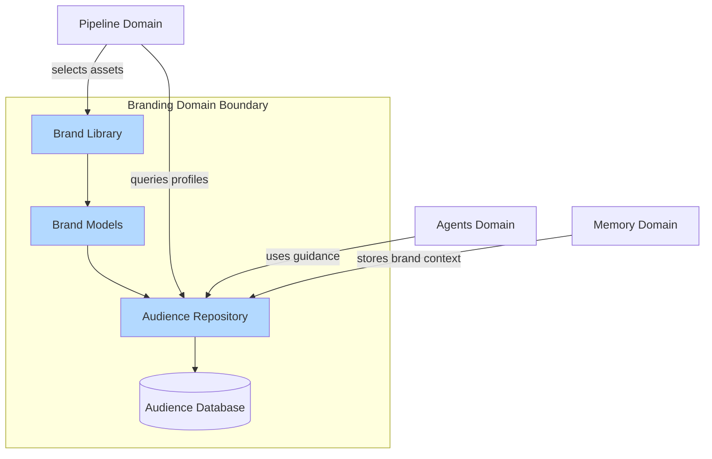
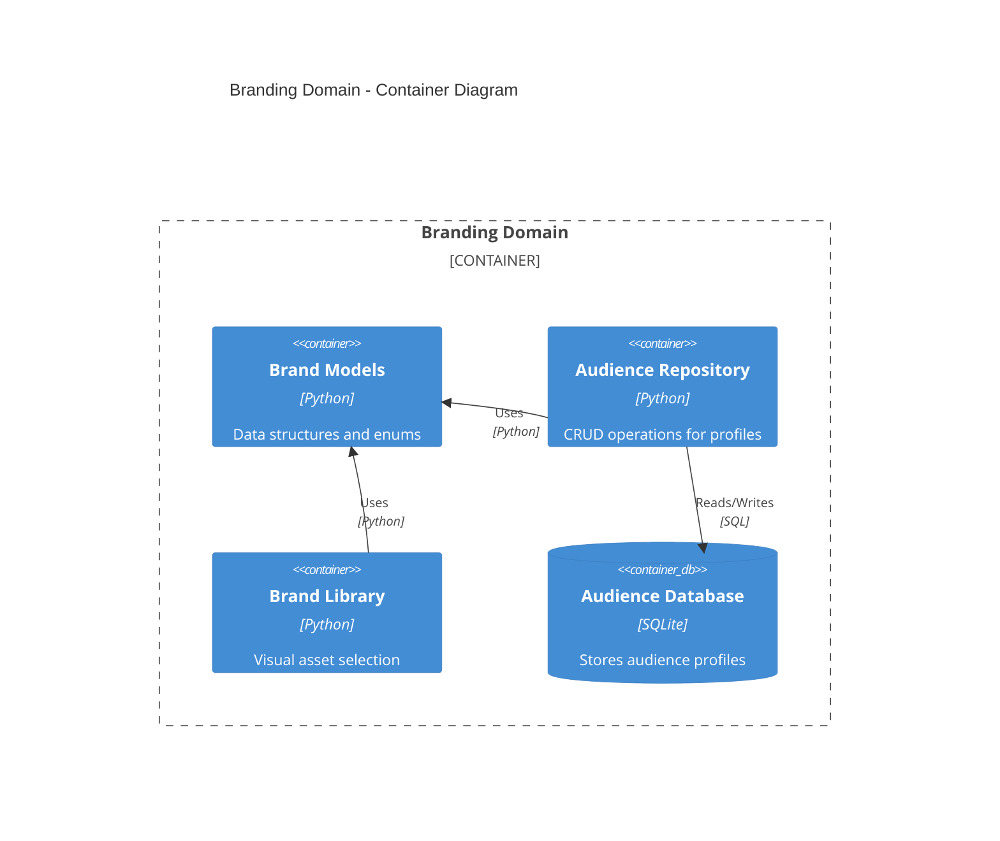
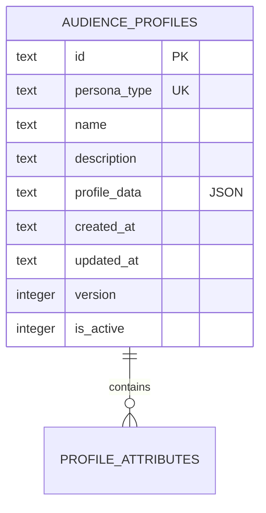

# Branding Domain Architecture

> **Document Type**: Domain Architecture Document (Level 2 - Container)
> **Parent**: [System Architecture](../../ARCHITECTURE.md)
> **Last Updated**: 2026-01-27
> **Version**: 1.0

## Document Scope

This document describes the architecture of the **Branding** bounded context. For system-wide context and principles, see the [root architecture document](../../ARCHITECTURE.md).

### What This Document Covers

- Internal structure of the Branding domain
- Services and components within this domain
- Data models owned by this domain
- Integration points with other domains (Pipeline, Memory, Agents)

### What This Document Does NOT Cover

- Implementation details of other domains
- System-wide security policies
- Infrastructure configuration

## Domain Overview

### Business Capability

The Branding domain provides strategic brand identity management, audience profiling, and visual asset libraries that guide content generation throughout the autonomous marketing agency system. It ensures all generated content aligns with brand identity, target audiences, and brand values while respecting user-defined parameters.

**What would happen if this domain didn't exist?**
- Content would lack brand consistency
- No strategic alignment with target audiences
- No visual asset management (palettes, typography, layouts)
- Manual brand guideline enforcement required
- Inconsistent messaging and visual identity

### Core Principle

**Branding as Guide, Not Override**: The branding system provides strategic guidance and defaults, but **never overrides explicit user definitions**. For example, if a user specifies `platform: "linkedin"`, the post will be generated for LinkedIn regardless of audience preferences. User-defined parameters take precedence over brand defaults.

### Domain Boundaries



### Ubiquitous Language

Key terms used within this domain. All code, documentation, and communication should use these terms consistently.

| Term | Definition | Notes |
|------|------------|-------|
| **Audience Profile** | Complete persona definition stored in database with all attributes (pain points, desires, communication style, etc.) | Single source of truth per persona type |
| **Persona Type** | Unique identifier for audience type (e.g., "c_level", "founder", "developer") | Used as primary key for profile lookup |
| **Color Palette** | Pre-validated set of brand colors with theme and best-for metadata | Selected based on platform, tone, and persona |
| **Typography Config** | Font configuration (e.g., Poppins Bold + Inter Regular) | Selected based on platform and audience |
| **Canvas Config** | Dimensions for platform/format combinations | Optimized per social media platform |
| **Brand Library** | Centralized repository of visual assets with selection logic | Provides intelligent asset selection |
| **Document Store** | Database design storing complete profiles as JSON documents | See [ADR-001](../../decisions/ADR-001-simplify-audience-profile-storage.md) |

## Component Architecture

### Container Diagram



### Service Catalog

#### Brand Models (`src/brand/models.py`)

| Attribute | Value |
|-----------|-------|
| **Responsibility** | Defines fundamental data structures for visual and strategic identity |
| **Technology** | Python dataclasses and enums |
| **Location** | `src/brand/models.py` |

**Core Enums**:
- `Platform`: Supported social media platforms (LinkedIn, Instagram, Twitter, YouTube, GitHub, Discord)
- `Audience`: Target audience types (C-Level, Founder, Developer)
- `BrandValue`: Core brand values (go_deep_or_go_home, open_source, community_collaboration, pioneer_new_world)

**Data Classes**:
- `ColorPalette`: Color palette definitions with theme and best-for metadata
- `TypographyConfig`: Typography configurations (Poppins Bold + Inter Regular)
- `CanvasConfig`: Canvas dimensions for platform/format combinations
- `VisualStyle`: Visual style definitions with characteristics and mood keywords
- `AudienceProfile`: Model class for audience profiles (database-backed)

#### Audience Repository (`src/brand/audience_repo.py`)

| Attribute | Value |
|-----------|-------|
| **Responsibility** | Database-backed repository for audience profile CRUD operations |
| **Technology** | Python, SQLite |
| **Location** | `src/brand/audience_repo.py` |

**Exposed Operations**:
- `get_profile(persona_type: str) -> Optional[Dict]` - Get complete profile by persona type
- `get_profile_by_id(profile_id: str) -> Optional[Dict]` - Get profile by ID
- `create_profile(...) -> str` - Create new profile
- `update_profile(persona_type: str, profile_data: Dict) -> bool` - Update existing profile
- `delete_profile(persona_type: str) -> bool` - Soft delete profile
- `deactivate_profile(persona_type: str) -> bool` - Deactivate without deletion
- `list_profiles(active_only: bool = True) -> List[Dict]` - List all profiles
- `search_profiles(query: str) -> List[Dict]` - Search profiles

**Consumed APIs**:
- SQLite database for storage

**Events Published**:
- None (synchronous operations only)

**Events Consumed**:
- None

#### Brand Library (`src/brand/library.py`)

| Attribute | Value |
|-----------|-------|
| **Responsibility** | Centralized repository of brand assets with intelligent selection logic |
| **Technology** | Python |
| **Location** | `src/brand/library.py` |

**Exposed Operations**:
- `select_palette(platform, tone, persona, theme_preference) -> ColorPalette` - Select color palette
- `select_typography(platform, audience) -> TypographyConfig` - Select typography
- `get_canvas_config(platform, format) -> CanvasConfig` - Get canvas dimensions

**Selection Logic**:
- Intelligent selection based on platform, tone, persona, and theme preference
- **Respects user-specified platform** - never overrides explicit user choices
- Maps platform to default audience type for guidance
- Applies theme (light/dark) based on tone and preferences

## Data Architecture

### Data Ownership

This domain is the **single source of truth** for the following data:

| Entity | Description | Sensitivity |
|--------|-------------|-------------|
| **Audience Profiles** | Complete persona definitions with all attributes | Internal |
| **Color Palettes** | Brand color definitions | Public |
| **Typography Configs** | Font configurations | Public |
| **Canvas Configs** | Platform/format dimensions | Public |

### Entity Relationship Diagram



### Database Schema

The audience profiles are stored using a **Document Store model** with SQLite, storing complete profiles as JSON documents. This design optimizes for the primary access pattern: query a specific profile by `persona_type` and use the complete profile data in prompt generation.

**Table: `audience_profiles`**

```sql
CREATE TABLE IF NOT EXISTS audience_profiles (
    id TEXT PRIMARY KEY,
    persona_type TEXT NOT NULL UNIQUE,
    name TEXT NOT NULL,
    description TEXT,
    profile_data TEXT NOT NULL,  -- Full profile structure as JSON
    created_at TEXT NOT NULL,      -- ISO 8601 timestamp
    updated_at TEXT NOT NULL,      -- ISO 8601 timestamp
    version INTEGER DEFAULT 1,
    is_active INTEGER DEFAULT 1    -- 1 = active, 0 = soft deleted
);

-- Indexes for primary access pattern
CREATE INDEX IF NOT EXISTS idx_audience_profiles_persona_type 
    ON audience_profiles(persona_type);
    
CREATE INDEX IF NOT EXISTS idx_audience_profiles_active 
    ON audience_profiles(is_active);
    
CREATE INDEX IF NOT EXISTS idx_audience_profiles_persona_active 
    ON audience_profiles(persona_type, is_active);
```

**Key Design Decisions** (per [ADR-001](../../decisions/ADR-001-simplify-audience-profile-storage.md)):
- **Document Store**: Complete profile stored as JSON document in `profile_data` column
- **Single Source of Truth**: All profile attributes stored in JSON (no data duplication)
- **Indexed Lookups**: Indexes on `persona_type` and `is_active` for fast primary access pattern
- **`persona_type` (UNIQUE)**: Ensures one active profile per persona type
- **`version`**: Supports profile versioning for tracking changes
- **`is_active`**: Soft delete capability, allows deactivating profiles without deletion

**Benefits**:
- ✅ Simplified architecture: Single source of truth eliminates data consistency risks
- ✅ Matches access pattern: Optimized for "get complete profile by persona_type"
- ✅ Flexible schema: JSON allows evolution without migrations
- ✅ Preserves all attributes: All essential prompt attributes maintained
- ✅ Easier maintenance: Simple read/write JSON operations

### Profile Data Structure

The `profile_data` JSON column contains the complete profile structure:

```json
{
  "name": "Decisor C-Level",
  "description": "C-Level executives from SMEs",
  "persona_type": "c_level",
  "personality_traits": [...],
  "pain_points": {...},
  "desires": {...},
  "communication_style": {
    "tone": "professional",
    "formality": "formal",
    "vocabulary": "sophisticated",
    "language_preferences": {...},
    "communication_channels": {...}
  },
  "platforms": [...],
  "formats": [...],
  "content_preferences": {...},
  "emotional_triggers": {...},
  "brand_values": [...],
  "customer_journey": {...},
  "professional_background": {...},
  "market_context": {...},
  "success_metrics": {...},
  "language_examples": {...}
}
```

### Data Lifecycle

| Entity | Creation | Updates | Deletion | Retention |
|--------|----------|---------|----------|-----------|
| **Audience Profiles** | Manual creation via repository | Update JSON, increment version | Soft delete (is_active=0) | Permanent (soft delete) |
| **Color Palettes** | Code-defined | Code changes | Code removal | Permanent |
| **Typography Configs** | Code-defined | Code changes | Code removal | Permanent |
| **Canvas Configs** | Code-defined | Code changes | Code removal | Permanent |

### Data Shared with Other Domains

| Data | Consuming Domain | Mechanism | Freshness |
|------|------------------|-----------|-----------|
| **Audience Profiles** | Pipeline, Agents | Repository API (sync) | Real-time |
| **Color Palettes** | Pipeline, Tools | Library API (sync) | Real-time |
| **Typography Configs** | Pipeline, Tools | Library API (sync) | Real-time |
| **Canvas Configs** | Pipeline, Tools | Library API (sync) | Real-time |

## Integration Points

### Upstream Dependencies

Services this domain depends on to function.

| Dependency | Type | Criticality | Fallback |
|------------|------|-------------|----------|
| **SQLite Database** | Storage | Critical | None (required) |

### Downstream Dependents

Services that depend on this domain.

| Dependent | Integration Type | SLA Commitment |
|-----------|------------------|----------------|
| **Pipeline Domain** | Repository API | Profile lookup < 10ms |
| **Agents Domain** | Repository API | Profile lookup < 10ms |
| **Memory Domain** | Repository API | Profile lookup < 10ms |
| **Tools Domain** | Library API | Asset selection < 1ms |

### Integration Flow

```
User Input (platform, persona, tone, format)
    │
    │ Priority: User Input > Brand Defaults
    │
    ▼
Branding System (Provides Guidance)
    │
    ├─→ Query Audience Profile from Database
    ├─→ Select Visual Assets (respects user platform)
    ├─→ Provide Communication Guidelines
    └─→ Suggest Content Structure
         │
         │ Enriches but doesn't override
         │
         ▼
Pipeline Phases
    │
    ├─→ Phase 1: Uses audience profile for ideation
    ├─→ Phase 2: Selects palette/typography (respects user platform)
    ├─→ Phase 3: Uses audience preferences for narrative structure
    ├─→ Phase 4: Applies visual branding
    └─→ Phase 5: Uses platform preferences
```

### Integration by Pipeline Phase

#### Phase 1: Ideation
- Queries audience profile from database based on user-specified platform or persona
- Uses profile's pain points, desires, and content preferences to guide idea generation
- Considers brand values in ideation
- **Respects user-defined platform/tone/persona** - branding enriches, doesn't override

#### Phase 2: Configuration
- Selects palette based on **user-specified** platform + tone + persona
- Selects typography based on **user-specified** platform + persona
- Loads audience profile from **database** and enriches idea (merges, doesn't override)
- Detects brand values from content
- Builds coherence brief with brand-aligned visual assets

#### Phase 3: Narrative Architect
- Receives audience profile (from database) in coherence brief context
- Uses content preferences to structure narrative
- Considers customer journey for pacing and transitions
- Uses emotional triggers to assign emotions per slide
- Aligns structure with preferred formats (when user hasn't specified)

#### Phase 4: Copywriting & Visual
- Uses selected palette and typography (from Phase 2, based on user platform)
- Applies visual branding consistently
- Can use language examples from audience profile for copywriting guidance

#### Phase 5: Caption
- Uses platform preferences from audience profile (when user hasn't specified)
- Aligns tone with communication style from profile

## Operational Characteristics

### Performance Requirements

| Operation | Target (p50) | Target (p99) | Current |
|-----------|--------------|--------------|---------|
| Profile Lookup | < 5ms | < 10ms | < 5ms |
| Asset Selection | < 1ms | < 2ms | < 1ms |
| Profile Creation | < 50ms | < 100ms | < 50ms |
| Profile Update | < 50ms | < 100ms | < 50ms |

### Scalability

| Dimension | Current Capacity | Maximum | Scaling Trigger |
|-----------|------------------|---------|-----------------|
| Profiles | 100 | 10,000 | Storage > 70% |
| Concurrent Lookups | 100/sec | 1,000/sec | Response time > 10ms |

### Availability

| Metric | Target | Current |
|--------|--------|---------|
| Uptime | 99.9% | 99.9% |
| RTO | < 1 hour | < 1 hour |
| RPO | < 5 minutes | < 5 minutes |

## Security Considerations

### Data Classification

All data in this domain is classified as: **Internal**

- Audience profiles: Internal (contains strategic marketing information)
- Visual assets: Public (brand guidelines are public-facing)

### Access Control

| Role | Permissions |
|------|-------------|
| **Content Creator** | Read profiles, read visual assets |
| **Brand Manager** | Full CRUD on profiles, read visual assets |
| **System** | Full access for pipeline operations |

### Compliance Requirements

This domain is subject to: None (internal marketing data)

## Domain-Specific Decisions

Architectural decisions specific to this domain. For system-wide decisions, see [ADR Index](../../decisions/README.md).

| ADR | Date | Summary |
|-----|------|---------|
| [ADR-001](../../decisions/ADR-001-simplify-audience-profile-storage.md) | 2026-01-27 | Simplify audience profile storage to document store model |

## Technical Debt

Known issues and planned improvements within this domain.

| Item | Impact | Effort | Priority | Ticket |
|------|--------|--------|----------|--------|
| Profile search functionality | Medium | Medium | 3 | - |
| Profile analytics dashboard | Low | High | 5 | - |

## Related Documents

- [System Architecture](../../ARCHITECTURE.md) - Root architecture document
- [Pipeline Domain](../pipeline/ARCHITECTURE.md) - How branding integrates with pipeline
- [Memory Domain](../memory/ARCHITECTURE.md) - How branding context is stored
- [ADR-001](../../decisions/ADR-001-simplify-audience-profile-storage.md) - Database design decision
