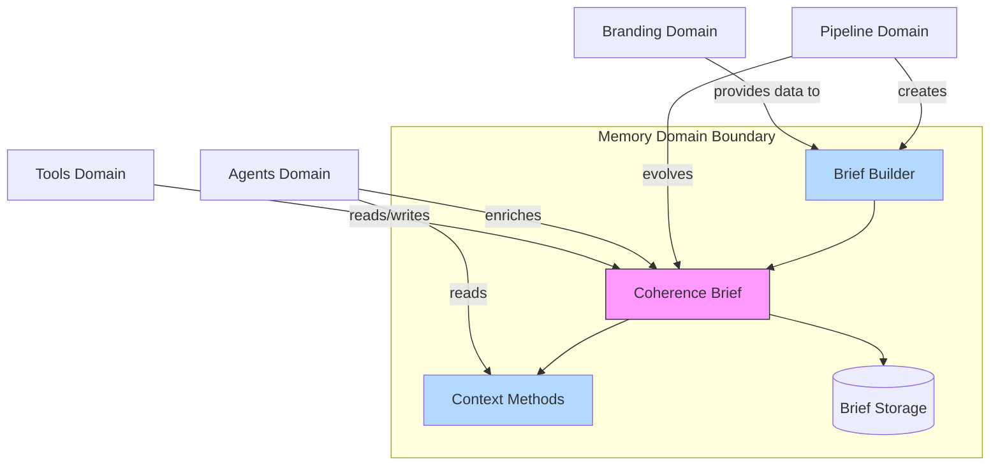
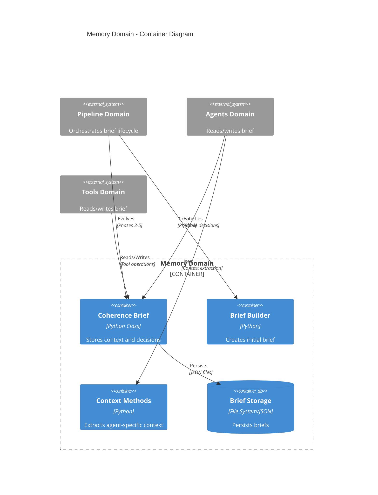
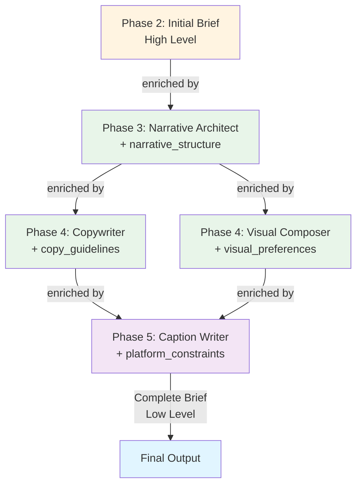

# Memory Domain Architecture

> **Document Type**: Domain Architecture Document (Level 2 - Container)
> **Parent**: [System Architecture](../../ARCHITECTURE.md)
> **Last Updated**: 2026-01-27
> **Version**: 1.0

## Document Scope

This document describes the architecture of the **Memory** bounded context. The Memory domain is a **key architectural component** of the system design, providing the Coherence Brief system that ensures consistency and context management across all operations. For system-wide context and principles, see the [root architecture document](../../ARCHITECTURE.md).

### What This Document Covers

- Internal structure of the Memory domain
- Coherence Brief system architecture
- Brief evolution through pipeline phases
- Context extraction methods for agents
- Integration with all other domains

### What This Document Does NOT Cover

- Pipeline orchestration (see [Pipeline Domain](../pipeline/ARCHITECTURE.md))
- Agent implementations (see [Agents Domain](../agents/ARCHITECTURE.md))
- Data structure schemas (see [Data Models](../../cross-cutting/data-models/ARCHITECTURE.md))

## Domain Overview

### Business Capability

The Memory domain provides the **Coherence Brief system**, which is the central memory mechanism and consistency contract for the entire content generation pipeline. The Coherence Brief is an evolutionary document that starts with high-level information and is incrementally enriched by each subsequent phase, ensuring per-post consistency and brand alignment.

**What would happen if this domain didn't exist?**
- No consistency guarantees across pipeline phases
- No context management for AI agents
- No memory of decisions made in earlier phases
- Inconsistent content generation
- No brand alignment tracking
- Fragmented, disconnected content pieces

### Core Principle

**Coherence Brief ensures consistency per-post** across all phases, serving as:
- **Context memory**: Stores decisions and guidelines
- **Coherence contract**: Defines voice, visual, emotions, content
- **Evolutionary document**: Grows with more detailed information at each phase

### Domain Boundaries



### Ubiquitous Language

Key terms used within this domain. All code, documentation, and communication should use these terms consistently.

| Term | Definition | Notes |
|------|------------|-------|
| **Coherence Brief** | Evolutionary document ensuring consistency per-post | Central memory mechanism |
| **Brief Evolution** | Process of incrementally enriching brief through phases | Each phase adds its decisions |
| **Context Method** | Specialized method to extract relevant context for agent | Each agent has unique context extraction |
| **Brief Enrichment** | Process of adding agent decisions back to brief | Agents enrich brief incrementally |
| **Per-Post Context** | Each post has its own brief instance | No global assumptions |

## Component Architecture

### Container Diagram



### Service Catalog

#### Coherence Brief (`src/coherence/brief.py`)

| Attribute | Value |
|-----------|-------|
| **Responsibility** | Stores context and decisions ensuring per-post consistency |
| **Technology** | Python dataclass |
| **Location** | `src/coherence/brief.py` |
| **Class** | `CoherenceBrief` |

**Core Sections**:
- `metadata` (post_id, idea_id, platform, format)
- `voice` (tone, personality_traits, vocabulary_level, formality)
- `visual` (palette_id, palette, typography_id, typography, style, mood, canvas)
- `emotions` (primary, secondary, avoid, target)
- `content` (keywords, themes, main_message, value_proposition, angle, hook)
- `audience` (persona, pain_points, desires)
- `constraints` (avoid_topics, required_elements)
- `structure` (objective, narrative_arc, estimated_slides)
- `context` (article_context, key_insights_used, key_insights_content)
- `brand` (values, assets)
- `evolution` (narrative_structure, copy_guidelines, visual_preferences, platform_constraints)

**Context Methods**:
- `to_narrative_architect_context()` → Context for Narrative Architect
- `to_copywriter_context()` → Context for Copywriter
- `to_visual_composer_context()` → Context for Visual Composer
- `to_caption_writer_context()` → Context for Caption Writer

**Enrichment Methods**:
- `enrich_from_narrative_structure(narrative_structure)` → Adds narrative decisions
- `enrich_from_copywriting(copy_guidelines)` → Adds copy guidelines
- `enrich_from_visual_composition(visual_preferences)` → Adds visual preferences
- `enrich_from_caption_writing(platform_constraints)` → Adds platform constraints

#### Brief Builder (`src/coherence/builder.py`)

| Attribute | Value |
|-----------|-------|
| **Responsibility** | Builds initial coherence brief from selected idea |
| **Technology** | Python |
| **Location** | `src/coherence/builder.py` |
| **Class** | `CoherenceBriefBuilder` |

**Process**:
1. Extracts fields from selected idea
2. Queries Branding domain for audience profile and visual assets
3. Selects palette, typography, canvas based on platform and tone
4. Builds initial brief with all high-level fields
5. Creates brief instance and stores in Memory domain

**Integration**:
- Queries Branding domain for profiles and assets
- Creates brief in Memory domain
- Used by Pipeline domain in Phase 2

## Data Architecture

### Data Ownership

This domain is the **single source of truth** for the following data:

| Entity | Description | Sensitivity |
|--------|-------------|-------------|
| **Coherence Brief** | Complete context and decisions per post | Internal |
| **Brief Evolution History** | Track of how brief evolved through phases | Internal |

### Brief Structure

The Coherence Brief is organized into logical sections:

#### 1. Metadata
```python
post_id: str              # Unique post identifier
idea_id: str              # Reference to source idea
platform: str             # Target platform (linkedin, instagram, etc.)
format: str               # Format (carousel, single_image)
```

#### 2. Voice
```python
tone: str                 # General tone (professional, casual, etc.)
personality_traits: List[str]  # Personality traits
vocabulary_level: str      # simple/moderate/sophisticated
formality: str            # casual/neutral/formal
```

#### 3. Visual
```python
palette_id: str           # Selected palette ID
palette: Dict[str, str]   # Complete color values
typography_id: str        # Typography ID
typography: Dict[str, str]  # Font configurations
visual_style: str         # Style description
visual_mood: str          # Mood keyword
canvas: Dict[str, Any]    # Canvas dimensions
```

#### 4. Emotions
```python
primary_emotion: str           # Primary target emotion
secondary_emotions: List[str]  # Secondary emotions
avoid_emotions: List[str]      # Emotions to avoid
target_emotions: List[str]     # All target emotions
```

#### 5. Content
```python
keywords_to_emphasize: List[str]  # Key terms to highlight
themes: List[str]                 # Content themes
main_message: str                 # Main message
value_proposition: str            # Value proposition
angle: str                        # Unique angle
hook: str                         # Opening hook
```

#### 6. Audience
```python
persona: str              # Target persona description
pain_points: List[str]    # Audience challenges
desires: List[str]        # Audience goals
```

#### 7. Constraints
```python
avoid_topics: List[str]        # Topics to avoid
required_elements: List[str]   # Required elements
```

#### 8. Structure
```python
objective: str            # Post objective
narrative_arc: str       # Narrative structure (high level)
estimated_slides: int     # Estimated number of slides
```

#### 9. Context
```python
article_context: str                    # Article summary for this post
key_insights_used: List[str]            # IDs of insights used
key_insights_content: List[Dict]        # Complete insight content
idea_explanation: Optional[str]         # Detailed idea explanation
rationale: Optional[str]               # Idea justification (1-2 sentences)
```

#### 10. Brand
```python
brand_values: List[str]        # Aligned brand values
brand_assets: Dict[str, str]   # Brand assets (handle, tagline, etc.)
```

#### 11. Evolution (Evolutionary Fields)

These fields are **added incrementally** by later phases:

**Phase 3: Narrative Architect**
```python
narrative_structure: Optional[Dict]  # Detailed slide-by-slide structure
narrative_pacing: Optional[str]     # "fast", "moderate", "deliberate"
transition_style: Optional[str]     # "abrupt", "smooth", "dramatic"
arc_refined: Optional[str]          # Refined narrative arc
narrative_rationale: Optional[Dict] # Narrative Architect justification
```

**Phase 4: Copywriter**
```python
copy_guidelines: Optional[Dict]  # Writing patterns
cta_guidelines: Optional[Dict]    # CTA details
```

**Phase 4: Visual Composer**
```python
visual_preferences: Optional[Dict]  # Layout/composition preferences
```

**Phase 5: Caption Writer**
```python
platform_constraints: Optional[Dict]  # Platform limits and formats
```

### Brief Evolution Lifecycle



### Data Lifecycle

| Entity | Creation | Updates | Deletion | Retention |
|--------|----------|---------|----------|-----------|
| **Coherence Brief** | Phase 2 (initial) | Phases 3-5 (enrichment) | After post completion | Permanent (in output directory) |

### Data Shared with Other Domains

| Data | Consuming Domain | Mechanism | Freshness |
|------|------------------|-----------|-----------|
| **Brief Context** | Agents Domain | Context methods (sync) | Real-time |
| **Brief Data** | Tools Domain | Direct access (sync) | Real-time |
| **Brief Storage** | Pipeline Domain | File system (sync) | Real-time |

## Context Extraction Methods

Each agent receives only necessary context via specialized methods:

### `to_narrative_architect_context()`

**Used by**: Narrative Architect (Phase 3)

**Fields Included**:
- `voice` (tone, personality, vocabulary, formality)
- `emotions` (primary, secondary, avoid)
- `content` (main_message, keywords, angle, hook)
- `structure` (objective, high-level narrative_arc, estimated_slides)
- `key_insights_content` (complete insights)
- `audience` (persona, pain_points, desires)
- `constraints` (avoid_topics, required_elements)

**Fields NOT included**:
- `visual` (not needed for narrative structure)
- `brand` (not needed in this phase)
- Evolutionary fields (don't exist yet)

### `to_copywriter_context()`

**Used by**: Copywriter (Phase 4)

**Fields Included**:
- `voice` (tone, personality, vocabulary, formality)
- `content` (main_message, keywords, angle, hook)
- `audience` (persona, pain_points, desires)
- `narrative_structure` (if available: pacing, transitions, slides)
- `key_insights_content` (complete insights)
- `constraints` (avoid_topics, required_elements)

**Fields NOT included**:
- `visual` (not needed for writing)
- `brand` (not needed in this phase)
- `platform_constraints` (doesn't exist yet)

### `to_visual_composer_context()`

**Used by**: Visual Composer (Phase 4)

**Fields Included**:
- `visual` (palette, typography, canvas, style, mood)
- `emotions` (primary, secondary, avoid)
- `narrative_structure` (pacing, transitions)
- `brand` (values, assets)

**Fields NOT included**:
- `voice` (not needed for visual design)
- `content` (not needed for visual design)
- `copy_guidelines` (doesn't exist yet)

### `to_caption_writer_context()`

**Used by**: Caption Writer (Phase 5)

**Fields Included**:
- `voice` (tone, formality, vocabulary)
- `platform` (target platform)
- `cta_guidelines` (from Copywriter)
- `platform_constraints` (if already exists)
- `brand` (handle, values)
- `content` (main_message, keywords)

**Fields NOT included**:
- `visual` (not needed for caption)
- `narrative_structure` (not needed for caption)
- `visual_preferences` (not needed for caption)

## Integration Points

### Upstream Dependencies

Services this domain depends on to function.

| Dependency | Type | Criticality | Fallback |
|------------|------|-------------|----------|
| **Branding Domain** | Profile/asset queries | High | Default values |
| **Pipeline Domain** | Orchestration | Critical | None (required) |

### Downstream Dependents

Services that depend on this domain.

| Dependent | Integration Type | SLA Commitment |
|-----------|------------------|----------------|
| **Pipeline Domain** | Brief lifecycle | Brief available after Phase 2 |
| **Agents Domain** | Context extraction | Context methods < 1ms |
| **Tools Domain** | Brief access | Brief read/write < 10ms |

### Integration Flow

```
Phase 2: Brief Builder
  ↓ Creates initial brief
  ↓ Queries Branding domain
  ↓ Stores brief in Memory domain
  ↓
Phase 3: Narrative Architect
  ↓ Reads context via to_narrative_architect_context()
  ↓ Generates narrative structure
  ↓ Enriches brief via enrich_from_narrative_structure()
  ↓
Phase 4: Copywriter & Visual Composer
  ↓ Read context via specialized methods
  ↓ Generate content/visuals
  ↓ Enrich brief via enrichment methods
  ↓
Phase 5: Caption Writer
  ↓ Reads context via to_caption_writer_context()
  ↓ Generates caption
  ↓ Enriches brief via enrich_from_caption_writing()
  ↓
Complete Brief (stored in output directory)
```

## Operational Characteristics

### Performance Requirements

| Operation | Target (p50) | Target (p99) | Current |
|-----------|--------------|--------------|---------|
| Brief Creation | < 100ms | < 500ms | < 100ms |
| Context Extraction | < 1ms | < 5ms | < 1ms |
| Brief Enrichment | < 10ms | < 50ms | < 10ms |
| Brief Serialization | < 50ms | < 200ms | < 50ms |

### Scalability

| Dimension | Current Capacity | Maximum | Scaling Trigger |
|-----------|------------------|---------|-----------------|
| Concurrent Briefs | 100 | 1,000 | Memory > 80% |
| Brief Size | 50KB | 500KB | Storage > 70% |

### Availability

| Metric | Target | Current |
|--------|--------|---------|
| Brief Availability | 100% | 100% |
| Context Extraction Success | 100% | 100% |

## Design Principles

### 1. Per-Post Context

Each post has its own brief instance. No global assumptions or shared state.

### 2. Incremental Enrichment

Brief starts high-level and gains detail through phases. Each phase adds its decisions without overriding previous ones.

### 3. Specialized Context

Each agent receives only necessary context via specialized methods. Reduces token usage and improves focus.

### 4. Immutable Evolution

Once a field is added to the brief, it's not modified (except by the same phase if needed). Ensures traceability.

### 5. Complete History

Brief stores complete evolution history, allowing debugging and quality analysis.

## Related Documents

- [System Architecture](../../ARCHITECTURE.md) - Root architecture document
- [Pipeline Domain](../pipeline/ARCHITECTURE.md) - How brief is used in pipeline
- [Agents Domain](../agents/ARCHITECTURE.md) - How agents use brief context
- [Tools Domain](../tools/ARCHITECTURE.md) - How tools access brief
- [Branding Domain](../branding/ARCHITECTURE.md) - How branding data enriches brief
- [Data Models](../../cross-cutting/data-models/ARCHITECTURE.md) - Brief JSON schema
