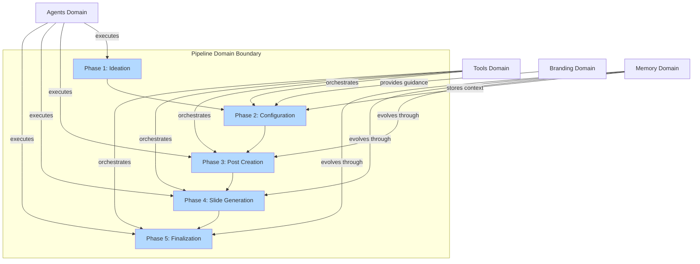
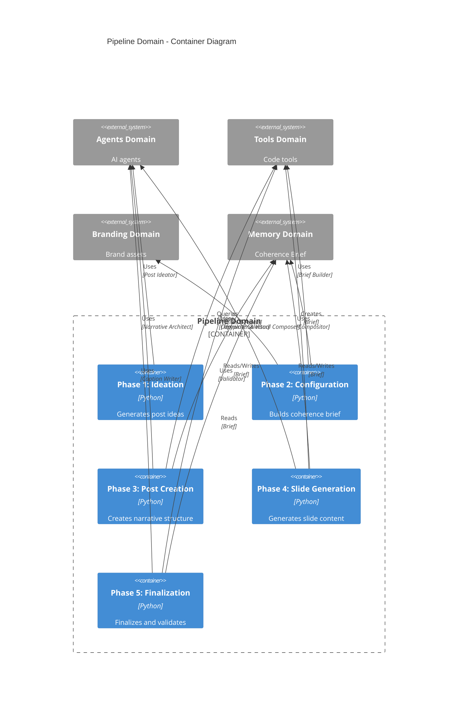
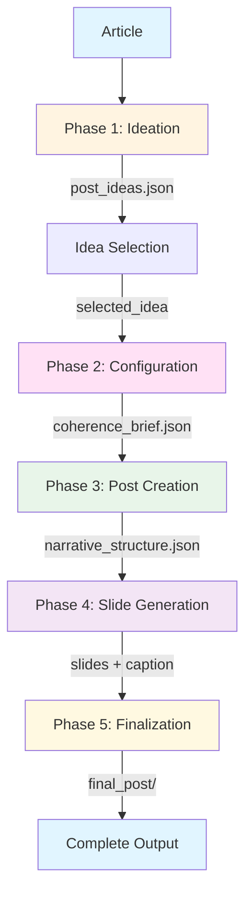

# Pipeline Domain Architecture

> **Document Type**: Domain Architecture Document (Level 2 - Container)
> **Parent**: [System Architecture](../../ARCHITECTURE.md)
> **Last Updated**: 2026-01-27
> **Version**: 1.0

## Document Scope

This document describes the architecture of the **Pipeline** bounded context. For system-wide context and principles, see the [root architecture document](../../ARCHITECTURE.md).

### What This Document Covers

- Internal structure of the Pipeline domain
- 5-phase content generation pipeline
- Data flow between phases
- Integration with agents, tools, branding, and memory domains

### What This Document Does NOT Cover

- Implementation details of AI agents (see [Agents Domain](../agents/ARCHITECTURE.md))
- Implementation details of code tools (see [Tools Domain](../tools/ARCHITECTURE.md))
- Coherence Brief structure details (see [Memory Domain](../memory/ARCHITECTURE.md))
- Branding system details (see [Branding Domain](../branding/ARCHITECTURE.md))

## Domain Overview

### Business Capability

The Pipeline domain orchestrates the end-to-end content generation process, transforming source materials (articles, briefs, strategic inputs) into high-quality marketing content including social media posts, campaigns, and brand-aligned creative assets. It coordinates specialized AI agents and code-based tools across 5 phases to ensure consistency, quality, and brand alignment.

**What would happen if this domain didn't exist?**
- No automated content generation workflow
- Manual coordination of all phases required
- No consistency guarantees across content pieces
- No quality validation gates
- Inefficient, error-prone content creation process

### Domain Boundaries



### Ubiquitous Language

Key terms used within this domain. All code, documentation, and communication should use these terms consistently.

| Term | Definition | Notes |
|------|------------|-------|
| **Phase** | A distinct stage in the content generation pipeline | 5 phases total: Ideation, Configuration, Post Creation, Slide Generation, Finalization |
| **Post** | A complete social media content piece with 1-12 slides and caption | Each post has unique platform, tone, persona configuration |
| **Idea** | A post concept generated in Phase 1 with configuration (platform, tone, persona) | Multiple ideas generated per article |
| **Coherence Brief** | Evolutionary document ensuring consistency per-post | Created in Phase 2, enriched through phases 3-5 |
| **Narrative Structure** | Slide-by-slide narrative architecture with template types | Created in Phase 3 by Narrative Architect |
| **Template Type** | High-level template category (hook, value, cta, transition) | Defined by Narrative Architect |
| **Template ID** | Specific textual template identifier (46 templates available) | Selected by Template Selector via semantic analysis |
| **Slide** | Single visual content unit with text and design | 1-12 slides per post |
| **Caption** | Platform-specific social media caption | Generated in Phase 5 |

## Component Architecture

### Container Diagram



### Pipeline Flow



### Phase Catalog

#### Phase 1: Ideation

| Attribute | Value |
|-----------|-------|
| **Responsibility** | Analyze article and generate 3-6 post ideas with per-post configuration |
| **Agent** | Post Ideator (AI) |
| **Tools** | Idea Selector (Code) |
| **Inputs** | `article.txt` |
| **Outputs** | `post_ideas.json` (ideas + article summary) |
| **Location** | `src/phases/phase1_ideation.py` |

**Process**:
1. Analyzes complete article
2. Extracts key insights
3. Generates 3-6 ideas with per-post configuration (platform, tone, persona)
4. Estimates number of slides per idea

**Validation**:
- ≥3 ideas generated?
- Ideas distinct?

**Integration**:
- Uses Post Ideator agent from Agents domain
- Uses Idea Selector tool from Tools domain
- May query Branding domain for audience guidance (optional)

#### Phase 2: Configuration

| Attribute | Value |
|-----------|-------|
| **Responsibility** | Build initial coherence brief and resolve post parameters |
| **Agents** | None (code-based) |
| **Tools** | Coherence Brief Builder, Parameter Resolver |
| **Inputs** | `selected_idea`, `article_summary`, `libraries/` (palettes, typography, layouts) |
| **Outputs** | `coherence_brief.json` (initial brief), `post_config.json` |
| **Location** | `src/coherence/builder.py` |

**Process**:
1. Extracts fields from idea (platform, tone, persona, etc.)
2. Selects palette based on platform + tone (from Branding domain)
3. Selects typography based on platform + tone (from Branding domain)
4. Defines canvas based on platform
5. Filters used insights
6. Builds initial brief with all high-level fields

**Validation**:
- Brief valid? (required fields present)
- Config complete?

**Integration**:
- Queries Branding domain for audience profiles and visual assets
- Creates Coherence Brief in Memory domain
- Uses Tools domain for brief building logic

#### Phase 3: Post Creation

| Attribute | Value |
|-----------|-------|
| **Responsibility** | Create detailed slide-by-slide narrative structure |
| **Agents** | Narrative Architect (AI) |
| **Tools** | Template Selector (Code) |
| **Inputs** | `coherence_brief.json` (initial brief), `article.txt` |
| **Outputs** | `narrative_structure.json` (with `template_type` and `value_subtype`), `narrative_structure_enriched.json` (with `template_id` per slide) |
| **Location** | `src/narrative/architect.py` |

**Process**:
1. **Narrative Architect** generates narrative structure:
   - Defines `template_type` per slide (hook, value, cta, transition)
   - Defines `value_subtype` for value slides (data, insight, solution, example)
   - Provides detailed `copy_direction` (50-300 words)
   - Defines `purpose`, `target_emotions`, `content_slots`
2. **Template Selector** selects specific `template_id`:
   - Uses semantic analysis (embeddings) to compare slide description with templates
   - Selects best match based on cosine similarity
   - Adds `template_id`, `justification`, `confidence` to each slide
3. Layout Resolver assigns layouts per slide
4. Enriches brief with narrative structure

**Validation**:
- ≥5 slides? (or 1 for single_image)
- Logical arc?
- All slides have `template_type`?
- Value slides have `value_subtype`?
- All slides have `template_id`? (after Template Selector)
- Confidence >0.5? (after Template Selector)

**Integration**:
- Uses Narrative Architect agent from Agents domain
- Uses Template Selector tool from Tools domain
- Reads and enriches Coherence Brief in Memory domain

#### Phase 4: Slide Generation

| Attribute | Value |
|-----------|-------|
| **Responsibility** | Generate content (text + visual) for each slide |
| **Agents** | Copywriter (AI), Visual Composer (AI) |
| **Tools** | Prompt Builders, Image Generator, Image Compositor |
| **Inputs** | `narrative_structure_enriched.json`, `coherence_brief.json`, `article.txt`, `templates_reference` |
| **Outputs** | `slide_content.json`, `visual_specs.json`, `final_slide.png` (per slide) |
| **Location** | `src/copywriting/writer.py`, `src/phases/phase4_slide_generation.py` |

**Process**:
1. **Copywriter** generates text for ALL slides in one call:
   - Uses template structures (`structure` field)
   - Fills placeholders with contextual content
   - Respects `length_range` and `tone` from templates
   - Maintains narrative flow
2. **Visual Composer** generates design per slide:
   - Generates background and visual elements
   - **Does NOT include text** (text added later)
   - Follows palette and typography from brief
3. **Prompt Builder (Image)** constructs prompt for image AI
4. **Image Generator** generates `background.png`
5. **Prompt Builder (Text)** constructs text rendering specifications
6. **Image Compositor** combines everything:
   - Loads background
   - Renders visual elements
   - Renders text with typography and colors
   - Applies emphasis (different colors)
   - Adds brand assets
   - Saves `final_slide.png`

**Validation**:
- Text within limits?
- Text follows template structure?
- Design without text?
- Correct dimensions?
- Text readable?

**Integration**:
- Uses Copywriter and Visual Composer agents from Agents domain
- Uses multiple tools from Tools domain (Prompt Builders, Image Generator, Compositor)
- Reads and enriches Coherence Brief in Memory domain

#### Phase 5: Finalization

| Attribute | Value |
|-----------|-------|
| **Responsibility** | Write caption and validate quality |
| **Agents** | Caption Writer (AI) |
| **Tools** | Output Assembler, Quality Validator |
| **Inputs** | `coherence_brief.json` (complete brief), `all_slide_contents[]`, `post_config.json` |
| **Outputs** | `caption.json`, `/output/post_xxx/` (complete directory), `validation_report.json` |
| **Location** | `src/phases/phase5_finalization.py` |

**Process**:
1. **Caption Writer** writes caption:
   - Generates platform-specific caption
   - Respects character limits
   - Includes appropriate hashtags
   - Uses CTA guidelines from Copywriter
2. **Output Assembler** packages everything:
   - Organizes slides in directory
   - Includes caption, brief, config
3. **Quality Validator** validates and scores:
   - Checks coherence (text follows brief? visual follows palette?)
   - Checks completeness (all slides? caption present?)
   - Checks visual quality (dimensions? text readable?)
   - Checks textual quality (text within limits? follows templates?)
   - Generates overall score and breakdown

**Validation**:
- Caption size OK?
- Score >0.7?

**Integration**:
- Uses Caption Writer agent from Agents domain
- Uses Output Assembler and Quality Validator tools from Tools domain
- Reads Coherence Brief from Memory domain

## Data Architecture

### Data Flow Between Phases

```
Article
  ↓
Phase 1: post_ideas.json
  ↓
Phase 2: coherence_brief.json (initial), post_config.json
  ↓
Phase 3: narrative_structure.json, narrative_structure_enriched.json
  ↓
Phase 4: slide_content.json, visual_specs.json, final_slide.png (per slide)
  ↓
Phase 5: caption.json, validation_report.json
  ↓
Complete Output Directory
```

### Coherence Brief Evolution

The Coherence Brief is the central data structure that evolves through phases:

```
Phase 2: Initial Brief (High Level)
  - metadata (post_id, platform, format)
  - voice (tone, personality_traits)
  - visual (palette, typography, canvas)
  - emotions (primary, secondary)
  - content (keywords, themes, hook)
  - audience (persona, pain_points, desires)
  - structure (objective, narrative_arc, estimated_slides)
  ↓
Phase 3: + Narrative Structure
  - narrative_structure (slides with template_type, value_subtype, template_id)
  - pacing, transition_style
  ↓
Phase 4: + Copy Guidelines
  - copy_directions per slide
  - visual_preferences
  ↓
Phase 5: + Final Context
  - complete slide contents
  - caption guidelines
```

### Data Ownership

This domain orchestrates data flow but does not own persistent data. Data ownership:

| Entity | Owner | Pipeline Role |
|--------|-------|---------------|
| **Post Ideas** | Pipeline (temporary) | Generated in Phase 1, consumed in Phase 2 |
| **Coherence Brief** | Memory Domain | Created in Phase 2, evolved through phases 3-5 |
| **Narrative Structure** | Pipeline (temporary) | Generated in Phase 3, consumed in Phase 4 |
| **Slide Content** | Pipeline (temporary) | Generated in Phase 4, consumed in Phase 5 |
| **Final Output** | Pipeline (output) | Generated in Phase 5, stored in output directory |

## Integration Points

### Upstream Dependencies

Services this domain depends on to function.

| Dependency | Type | Criticality | Fallback |
|------------|------|-------------|----------|
| **Agents Domain** | Agent execution | Critical | None (required) |
| **Tools Domain** | Tool execution | Critical | None (required) |
| **Branding Domain** | Profile/asset queries | High | Default values |
| **Memory Domain** | Brief storage | Critical | None (required) |

### Downstream Dependents

Services that depend on this domain.

| Dependent | Integration Type | SLA Commitment |
|-----------|------------------|----------------|
| **Content Consumers** | File output | Output available after Phase 5 |
| **Quality Systems** | Validation reports | Reports generated per post |

### External Integrations

Third-party services this domain integrates with.

| Provider | Purpose | Criticality | Documentation |
|----------|---------|-------------|---------------|
| **LLM Provider** | AI content generation | Critical | DeepSeek, OpenAI APIs |
| **Image Generator** | Visual asset generation | High | DALL-E 3 API |

## Operational Characteristics

### Performance Requirements

| Operation | Target (p50) | Target (p99) | Current |
|-----------|--------------|--------------|---------|
| Phase 1 (Ideation) | < 30s | < 60s | < 30s |
| Phase 2 (Configuration) | < 5s | < 10s | < 5s |
| Phase 3 (Post Creation) | < 60s | < 120s | < 60s |
| Phase 4 (Slide Generation) | < 120s | < 240s | < 120s |
| Phase 5 (Finalization) | < 30s | < 60s | < 30s |
| **Total Pipeline** | < 4 minutes | < 8 minutes | < 4 minutes |

### Cost Metrics

**Per post (7 slides)**:
- **LLM Calls**: ~15 calls
- **Tokens**: ~12k tokens
- **Cost**: ~$0.50

**Template Selection**:
- Initialization: ~2-3 seconds (pre-compute embeddings, once per process)
- Per slide: ~100ms (semantic analysis) or ~5ms (fallback keyword)
- Total for 7 slides: ~700ms (with embeddings) or ~35ms (fallback)

### Scalability

| Dimension | Current Capacity | Maximum | Scaling Trigger |
|-----------|------------------|---------|-----------------|
| Posts per hour | 10 | 100 | Queue depth > 50 |
| Parallel posts | 5 | 20 | CPU < 70% |
| Parallel slides | 7 | 14 | Memory < 80% |

### Availability

| Metric | Target | Current |
|--------|--------|---------|
| Pipeline Success Rate | > 95% | > 95% |
| Phase Retry Success | > 90% | > 90% |

## Design Principles

### 1. Single Responsibility Prompts

Each prompt handles one task:
- ✅ Prompt 1: "From article, generate 3-6 post ideas with config per post"
- ✅ Prompt 2: "For selected idea, build narrative skeleton slide-by-slide"
- ✅ Prompt 3: "Write copy for text slots of a slide"

### 2. Code Decides, AI Creates

Code handles consistency:

| Code Decides | AI Creates |
|--------------|------------|
| Palette/typography selection | Post ideas / narrative arcs |
| Layout positions | Copy / visual descriptions |
| Slide composition | Hooks / CTAs |

### 3. Per-Post Context

Each post receives personalized context (platform, tone, etc.) from ideation. No global assumptions.

### 4. Coherence Through Constraint

- **Coherence Brief**: JSON per post that travels through phases
- **Libraries**: LLM selects from options, doesn't invent
- **Gates**: Validates before advancing

### 5. Graceful Defaults

Input: Only article. System auto-suggests/assigns parameters per post.

## Quality Validation

### Validation Gates (Per Phase)

- **Phase 1**: ≥3 ideas? Distinct?
- **Phase 2**: Config complete? Brief valid?
- **Phase 3**: ≥5 slides? Logical arc? All have `template_type`? Value slides have `value_subtype`?
- **Phase 3a**: All have `template_id`? Confidence >0.5?
- **Phase 4**: Text within limits? Text follows template structure? Design without text? Correct dimensions?
- **Phase 5**: Caption size OK? Score >0.7?

**Retry**: 2 attempts with feedback; fallback to defaults.

### Quality Score (Per Post)

```json
{
  "post_id": "post_001",
  "score": 0.85,
  "breakdown": {
    "coherence": 0.9,
    "visual": 0.8,
    "textual": 0.85,
    "completeness": 1.0
  },
  "passed": true
}
```

## Output Structure

```
output/
  post_001/
    slides/
      slide_01.png
      slide_02.png
      ...
      slide_07.png
    caption.json
    coherence_brief.json
    post_config.json
    narrative_structure.json
    validation_report.json
```

## Related Documents

- [System Architecture](../../ARCHITECTURE.md) - Root architecture document
- [Agents Domain](../agents/ARCHITECTURE.md) - AI agents used by pipeline
- [Tools Domain](../tools/ARCHITECTURE.md) - Code tools used by pipeline
- [Memory Domain](../memory/ARCHITECTURE.md) - Coherence Brief system
- [Branding Domain](../branding/ARCHITECTURE.md) - Brand assets and profiles
- [Data Models](../../cross-cutting/data-models/ARCHITECTURE.md) - JSON schema definitions
