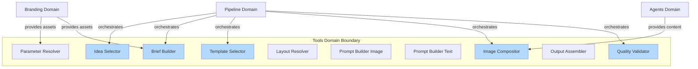
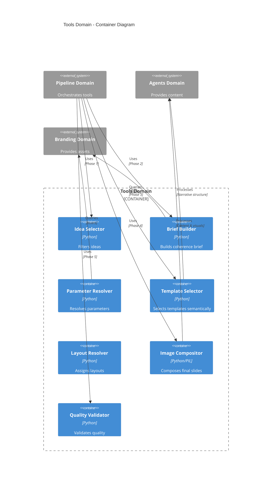
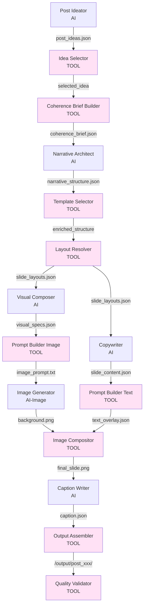

# Tools Domain Architecture

> **Document Type**: Domain Architecture Document (Level 2 - Container)
> **Parent**: [System Architecture](../../ARCHITECTURE.md)
> **Last Updated**: 2026-01-27
> **Version**: 1.0

## Document Scope

This document describes the architecture of the **Tools** bounded context. For system-wide context and principles, see the [root architecture document](../../ARCHITECTURE.md).

### What This Document Covers

- Internal structure of the Tools domain
- 11 code-based tools for logic, consistency, and orchestration
- Tool selection algorithms and deterministic behavior
- Integration with agents and pipeline phases

### What This Document Does NOT Cover

- AI agent implementations (see [Agents Domain](../agents/ARCHITECTURE.md))
- Pipeline orchestration (see [Pipeline Domain](../pipeline/ARCHITECTURE.md))
- Design library definitions (see [Branding Domain](../branding/ARCHITECTURE.md))

## Domain Overview

### Business Capability

The Tools domain provides deterministic, code-based tools that orchestrate logic, make rule-based selections, and process data throughout the content generation pipeline. These tools complement AI agents, following the principle **"Code Decides, AI Creates"**.

**What would happen if this domain didn't exist?**
- No deterministic consistency guarantees
- No rule-based asset selection
- No template matching logic
- No image composition capabilities
- No quality validation
- Inconsistent, unpredictable outputs

### Core Principle

**Code Decides, AI Creates**: Code handles consistency and logic; AI creates creative content.

| Code Decides | AI Creates |
|--------------|------------|
| Palette/typography selection | Post ideas / narrative arcs |
| Layout positions | Copy / visual descriptions |
| Slide composition | Hooks / CTAs |
| Template selection | Textual content |

### Domain Boundaries



### Ubiquitous Language

Key terms used within this domain. All code, documentation, and communication should use these terms consistently.

| Term | Definition | Notes |
|------|------------|-------|
| **Tool** | Deterministic code-based component for logic and consistency | 11 tools total |
| **Semantic Analysis** | Template selection using embeddings and cosine similarity | 91% accuracy |
| **Template ID** | Specific textual template identifier from library | 46 templates available |
| **Layout** | Pre-defined visual layout with text slot positions | Selected based on template |
| **Composition** | Process of combining background, elements, and text into final slide | Image compositor tool |

## Component Architecture

### Container Diagram



### Tool Catalog

#### 1. Idea Selector (Phase 1)

| Attribute | Value |
|-----------|-------|
| **Responsibility** | Filter/select ideas generated by Post Ideator |
| **Technology** | Python |
| **Location** | `src/phases/phase1_ideation.py` |

**Inputs**:
- `post_ideas.json` (all generated ideas)
- `filter_config` (optional filter configuration)

**Outputs**:
- `filtered_ideas.json` (selected ideas)

**Logic**:
- Automatic filter: selects top N ideas by confidence
- Manual filter: allows interactive selection
- Validation: ≥3 ideas? Distinct?

**Example**:
```python
def filter_ideas(ideas: List[Dict], max_ideas: int = 6) -> List[Dict]:
    """Selects top N ideas by confidence"""
    sorted_ideas = sorted(ideas, key=lambda x: x.get("confidence", 0), reverse=True)
    return sorted_ideas[:max_ideas]
```

#### 2. Coherence Brief Builder (Phase 2)

| Attribute | Value |
|-----------|-------|
| **Responsibility** | Build initial coherence brief from selected idea |
| **Technology** | Python |
| **Location** | `src/coherence/builder.py` |

**Inputs**:
- `selected_idea` (selected idea)
- `article_summary` (article summary)
- `libraries/` (palettes, typography, layouts)

**Outputs**:
- `coherence_brief.json` (initial brief)

**Logic**:
- Extracts fields from idea: `platform`, `tone`, `persona`, `angle`, `hook`
- Selects palette based on `platform` + `tone` (from Branding domain)
- Selects typography based on `platform` + `tone` (from Branding domain)
- Filters used insights from idea
- Defines canvas based on `platform`

**Fields Created**:
- `metadata` (post_id, idea_id, platform, format)
- `voice` (tone, personality_traits, vocabulary_level, formality)
- `visual` (palette_id, palette, typography_id, typography, style, mood, canvas)
- `emotions` (primary, secondary, avoid, target)
- `content` (keywords, themes, main_message, value_proposition, angle, hook)
- `audience` (persona, pain_points, desires)
- `constraints` (avoid_topics, required_elements)
- `structure` (objective, narrative_arc, estimated_slides)
- `context` (article_context, key_insights_used, key_insights_content)
- `brand` (values, assets)

#### 3. Parameter Resolver (Phase 2)

| Attribute | Value |
|-----------|-------|
| **Responsibility** | Resolve post parameters (palette, typography, canvas) from libraries |
| **Technology** | Python |
| **Location** | `src/phases/phase2_configuration.py` |

**Inputs**:
- `selected_idea` (selected idea)
- `libraries/` (palettes, typography, layouts)

**Outputs**:
- `post_config.json` (complete post configuration)

**Logic**:
- Selects palette from `libraries/palettes/`
- Selects typography from `libraries/typography/`
- Defines canvas based on `platform`
- Resolves brand assets

#### 4. Template Selector (Post-Phase 3)

| Attribute | Value |
|-----------|-------|
| **Responsibility** | Select specific `template_id` per slide using semantic analysis |
| **Technology** | Python, sentence-transformers |
| **Location** | `src/templates/selector.py` |

**Inputs**:
- `narrative_structure.json` (with `template_type` and `value_subtype` per slide)
- `template_library` (46 predefined templates)

**Outputs**:
- `narrative_structure_enriched.json` (with `template_id`, `template_justification`, `template_confidence` per slide)

**Technology**:
- **Primary**: Semantic analysis with embeddings (`sentence-transformers`)
  - Model: `all-MiniLM-L6-v2` (384 dimensions)
  - Pre-computes embeddings of all templates (initialization: ~2-3s)
  - Compares slide description with templates via cosine similarity
  - **91% accuracy**
- **Fallback**: Keyword matching + Jaccard similarity (if embeddings unavailable)
  - **68% accuracy**

**Process**:
1. Maps `template_type` + `value_subtype` to `module_type` (hook, valor_dado, valor_insight, etc.)
2. Filters candidate templates by `module_type`
3. Constructs slide description: `purpose` + `copy_direction` + `key_elements`
4. Generates embedding of description
5. Compares with pre-computed template embeddings
6. Selects template with highest cosine similarity
7. Adds `template_id`, `justification`, `confidence` to slide

**Performance**:
- Initialization: ~2-3 seconds (pre-compute embeddings, once per process)
- Per slide: ~100ms (semantic analysis) or ~5ms (fallback keyword)
- Total for 7 slides: ~700ms (with embeddings) or ~35ms (fallback)

#### 5. Layout Resolver (Phase 3)

| Attribute | Value |
|-----------|-------|
| **Responsibility** | Assign layouts per slide from layout library |
| **Technology** | Python |
| **Location** | `src/phases/phase3_post_creation.py` |

**Inputs**:
- `narrative_structure_enriched.json` (structure with `template_id` per slide)
- `libraries/layouts/` (predefined layouts)

**Outputs**:
- `slide_layouts.json` (layout assigned per slide)

**Logic**:
- Selects layout based on `template_type` and `template_id`
- Considers `content_slots` defined by Narrative Architect
- Respects canvas constraints

#### 6. Prompt Builder (Image) (Phase 4)

| Attribute | Value |
|-----------|-------|
| **Responsibility** | Build prompt for background image generation |
| **Technology** | Python |
| **Location** | `src/phases/phase4_slide_generation.py` |

**Inputs**:
- `visual_specs.json` (visual specifications from Visual Composer)
- `post_config.json` (post configuration)

**Outputs**:
- `image_prompt.txt` (prompt for DALL-E 3 or similar)

**Logic**:
- Combines `visual_specs` (background, elements) with `post_config` (palette, style)
- Generates descriptive prompt for image AI
- **Does NOT include text** (text added later by Image Compositor)

#### 7. Image Generator (Phase 4)

| Attribute | Value |
|-----------|-------|
| **Responsibility** | Generate background image using image AI |
| **Technology** | Python, DALL-E 3 API |
| **Location** | `src/phases/phase4_slide_generation.py` |

**Inputs**:
- `image_prompt.txt` (constructed prompt)

**Outputs**:
- `background.png` (background image)

**Technology**:
- DALL-E 3 (or similar)
- Generates only background (without text)

#### 8. Prompt Builder (Text) (Phase 4)

| Attribute | Value |
|-----------|-------|
| **Responsibility** | Build text rendering specifications |
| **Technology** | Python |
| **Location** | `src/phases/phase4_slide_generation.py` |

**Inputs**:
- `slide_content.json` (text generated by Copywriter)
- `slide_layout` (assigned layout)

**Outputs**:
- `text_overlay.json` (position, font, color, emphasis specifications)

**Logic**:
- Maps `slide_content` to positions from `slide_layout`
- Applies typography from brief
- Defines emphasis colors based on `emphasis[]` from Copywriter

#### 9. Image Compositor (Phase 4)

| Attribute | Value |
|-----------|-------|
| **Responsibility** | Combine background + elements + text into final slide |
| **Technology** | Python, Pillow (PIL) |
| **Location** | `src/phases/phase4_slide_generation.py` |

**Inputs**:
- `background.png` (background image)
- `text_overlay.json` (text specifications)
- `visual_specs.json` (visual elements)
- `brand_assets` (brand assets)

**Outputs**:
- `final_slide.png` (complete slide)

**Process**:
1. Loads `background.png`
2. Renders visual elements (`visual_specs.elements`)
3. Renders text (`text_overlay.texts`) with typography and colors
4. Applies emphasis (different colors for highlighted words)
5. Adds brand assets (logo, handle)
6. Saves `final_slide.png`

#### 10. Output Assembler (Phase 5)

| Attribute | Value |
|-----------|-------|
| **Responsibility** | Package all post outputs |
| **Technology** | Python |
| **Location** | `src/phases/phase5_finalization.py` |

**Inputs**:
- All slides (`final_slide.png` per slide)
- `caption.json` (caption)
- `coherence_brief.json` (complete brief)
- `post_config.json` (configuration)

**Outputs**:
- `/output/post_xxx/` (directory with all files)

**Output Structure**:
```
output/
  post_001/
    slides/
      slide_01.png
      slide_02.png
      ...
      slide_07.png
    caption.json
    coherence_brief.json
    post_config.json
    narrative_structure.json
```

#### 11. Quality Validator (Phase 5)

| Attribute | Value |
|-----------|-------|
| **Responsibility** | Validate and score post quality |
| **Technology** | Python |
| **Location** | `src/phases/phase5_finalization.py` |

**Inputs**:
- All post outputs

**Outputs**:
- `validation_report.json` (validation report)

**Validations**:
- **Coherence**: Text follows brief? Visual follows palette?
- **Completeness**: All slides generated? Caption present?
- **Visual Quality**: Correct dimensions? Text readable?
- **Textual Quality**: Text within limits? Follows templates?

**Example Output**:
```json
{
  "post_id": "post_001",
  "score": 0.85,
  "breakdown": {
    "coherence": 0.9,
    "visual": 0.8,
    "textual": 0.85,
    "completeness": 1.0
  },
  "passed": true,
  "warnings": [
    "Slide 3: Text slightly exceeds recommended length"
  ]
}
```

## Tool Execution Flow



## Design Principles

### 1. Determinism

Tools are **deterministic**: same input → same output.

### 2. Rule-Based Selection

Tools use explicit rules (not LLM) for selections:
- Palette: `if platform == "linkedin" and tone == "professional" → "dark_professional_01"`
- Template: Semantic analysis (embeddings) with fallback to keywords

### 3. Rigorous Validation

Each tool validates its outputs:
- Coherence Brief Builder: Validates required fields
- Template Selector: Validates confidence >0.5
- Image Compositor: Validates dimensions and readability

### 4. Extensibility

Easy to add new:
- Templates: Add to `textual_templates.py` → automatically integrated
- Palettes: Add to `libraries/palettes/` → automatically available
- Layouts: Add to `libraries/layouts/` → automatically selectable

## Integration Points

### Upstream Dependencies

Services this domain depends on to function.

| Dependency | Type | Criticality | Fallback |
|------------|------|-------------|----------|
| **Branding Domain** | Asset queries | High | Default values |
| **Agents Domain** | Content processing | Critical | None (required) |
| **Pipeline Domain** | Orchestration | Critical | None (required) |

### Downstream Dependents

Services that depend on this domain.

| Dependent | Integration Type | SLA Commitment |
|-----------|------------------|----------------|
| **Pipeline Domain** | Tool execution | Tool response < 1s (except Template Selector) |
| **Agents Domain** | Content processing | Content available after tool execution |

## Operational Characteristics

### Performance Requirements

| Tool | Target (p50) | Target (p99) | Current |
|------|--------------|--------------|---------|
| Idea Selector | < 10ms | < 50ms | < 10ms |
| Brief Builder | < 100ms | < 500ms | < 100ms |
| Template Selector | < 700ms (7 slides) | < 1500ms | < 700ms |
| Image Compositor | < 2s per slide | < 5s per slide | < 2s |
| Quality Validator | < 1s | < 3s | < 1s |

### Template Selection Performance

- **Initialization**: ~2-3 seconds (pre-compute embeddings, once per process)
- **Per slide**: ~100ms (semantic analysis) or ~5ms (fallback keyword)
- **Total for 7 slides**: ~700ms (with embeddings) or ~35ms (fallback)
- **Accuracy**: 91% with embeddings, 68% with fallback

## Related Documents

- [System Architecture](../../ARCHITECTURE.md) - Root architecture document
- [Pipeline Domain](../pipeline/ARCHITECTURE.md) - How tools are orchestrated
- [Agents Domain](../agents/ARCHITECTURE.md) - AI agents that complement tools
- [Branding Domain](../branding/ARCHITECTURE.md) - Asset libraries used by tools
