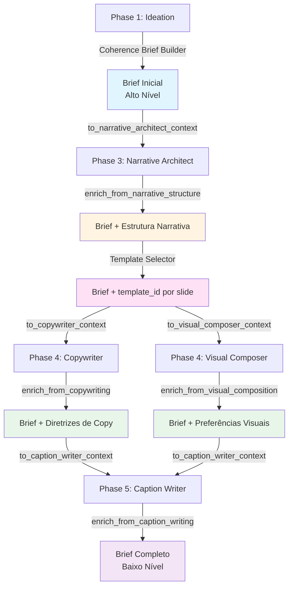

# Arquitetura: Gerenciamento de Memória (Coherence Brief)

> **Versão**: 2.1  
> **Data**: 2026-01-14  
> **Status**: Documentação de Memória  
> **Autor**: Sistema de Documentação Automatizada

---

## Visão Geral

O **Coherence Brief** é o mecanismo central de gerenciamento de memória e contexto do pipeline. É um **documento evolutivo e dinâmico** que começa com informações de alto nível na Phase 1 e é enriquecido incrementalmente por cada fase subsequente.

### Princípio Fundamental

**O Coherence Brief garante consistência per-post** através de todas as fases, servindo como:
- **Memória de contexto**: Armazena decisões e diretrizes
- **Contrato de coerência**: Define voice, visual, emotions, content
- **Documento evolutivo**: Cresce com informações mais detalhadas a cada fase

---

## Estrutura do Coherence Brief

### Localização

**Código**: `src/coherence/brief.py`  
**Classe**: `CoherenceBrief`

### Campos Principais

O brief é organizado em seções lógicas:

#### 1. Metadata
```python
post_id: str              # Identificador único do post
idea_id: str              # Referência à ideia origem
platform: str             # Plataforma alvo (linkedin, instagram, etc.)
format: str               # Formato (carousel, single_image)
```

#### 2. Voice
```python
tone: str                 # Tom geral (professional, casual, etc.)
personality_traits: List[str]  # Traços de personalidade
vocabulary_level: str      # simple/moderate/sophisticated
formality: str            # casual/neutral/formal
```

#### 3. Visual
```python
palette_id: str           # ID da paleta selecionada
palette: Dict[str, str]   # Valores de cores completos
typography_id: str        # ID da tipografia
typography: Dict[str, str]  # Configurações de fontes
visual_style: str         # Descrição do estilo
visual_mood: str          # Palavra-chave de mood
canvas: Dict[str, Any]    # Dimensões do canvas
```

#### 4. Emotions
```python
primary_emotion: str           # Emoção principal alvo
secondary_emotions: List[str]  # Emoções secundárias
avoid_emotions: List[str]      # Emoções a evitar
target_emotions: List[str]     # Todas as emoções alvo
```

#### 5. Content
```python
keywords_to_emphasize: List[str]  # Termos chave a destacar
themes: List[str]                 # Temas do conteúdo
main_message: str                 # Mensagem principal
value_proposition: str            # Proposta de valor
angle: str                        # Ângulo único
hook: str                         # Gancho de abertura
```

#### 6. Audience
```python
persona: str              # Descrição da persona alvo
pain_points: List[str]    # Desafios da audiência
desires: List[str]        # Objetivos da audiência
```

#### 7. Constraints
```python
avoid_topics: List[str]        # Tópicos a evitar
required_elements: List[str]   # Elementos obrigatórios
```

#### 8. Structure
```python
objective: str            # Objetivo do post
narrative_arc: str       # Estrutura narrativa (alto nível)
estimated_slides: int     # Número estimado de slides
```

#### 9. Context
```python
article_context: str                    # Resumo do artigo para este post
key_insights_used: List[str]            # IDs dos insights usados
key_insights_content: List[Dict]        # Conteúdo completo dos insights
idea_explanation: Optional[str]         # Explicação detalhada da ideia
rationale: Optional[str]               # Justificativa da ideia (1-2 frases)
```

#### 10. Brand
```python
brand_values: List[str]        # Valores da marca alinhados
brand_assets: Dict[str, str]   # Assets da marca (handle, tagline, etc.)
```

#### 11. Evolution (Campos Evolutivos)

Estes campos são **adicionados incrementalmente** por fases posteriores:

**Phase 3: Narrative Architect**
```python
narrative_structure: Optional[Dict]  # Estrutura detalhada slide-por-slide
narrative_pacing: Optional[str]     # "fast", "moderate", "deliberate"
transition_style: Optional[str]     # "abrupt", "smooth", "dramatic"
arc_refined: Optional[str]          # Arco narrativo refinado
narrative_rationale: Optional[Dict] # Justificativa do Narrative Architect
```

**Phase 4: Copywriter**
```python
copy_guidelines: Optional[Dict]  # Padrões de escrita
cta_guidelines: Optional[Dict]    # Detalhes de CTA
```

**Phase 4: Visual Composer**
```python
visual_preferences: Optional[Dict]  # Preferências de layout/composição
```

**Phase 5: Caption Writer**
```python
platform_constraints: Optional[Dict]  # Limites e formatos da plataforma
```

---

## Fluxo Evolutivo

### Phase 1: Brief Inicial (Alto Nível)

**Criado por**: `CoherenceBriefBuilder`  
**Localização**: `src/coherence/builder.py`

**Campos Preenchidos**:
- ✅ Metadata (post_id, idea_id, platform, format)
- ✅ Voice (tone, personality_traits, vocabulary_level, formality)
- ✅ Visual (palette_id, palette, typography_id, typography, style, mood, canvas)
- ✅ Emotions (primary, secondary, avoid, target)
- ✅ Content (keywords, themes, main_message, value_proposition, angle, hook)
- ✅ Audience (persona, pain_points, desires)
- ✅ Constraints (avoid_topics, required_elements)
- ✅ Structure (objective, narrative_arc alto nível, estimated_slides)
- ✅ Context (article_context, key_insights_used, key_insights_content)
- ✅ Brand (values, assets)

**Campos NÃO preenchidos** (serão adicionados depois):
- ❌ `narrative_structure` → Adicionado por Narrative Architect
- ❌ `copy_guidelines` → Adicionado por Copywriter
- ❌ `visual_preferences` → Adicionado por Visual Composer
- ❌ `platform_constraints` → Adicionado por Caption Writer

**Exemplo de Brief Inicial**:
```json
{
  "metadata": {
    "post_id": "post_article_slug_idea_1",
    "idea_id": "idea_1",
    "platform": "linkedin",
    "format": "carousel"
  },
  "voice": {
    "tone": "professional",
    "personality_traits": ["authoritative", "insightful"],
    "vocabulary_level": "sophisticated",
    "formality": "formal"
  },
  "visual": {
    "palette_id": "brand_dark_professional",
    "palette": {"primary": "#000000", "accent": "#0060FF", "theme": "dark"},
    "typography_id": "brand_professional",
    "style": "clean_professional_data_focused",
    "mood": "dramatic_focused"
  },
  "emotions": {
    "primary": "urgency",
    "secondary": ["curiosity"],
    "avoid": ["fear"]
  },
  "content": {
    "keywords_to_emphasize": ["AI", "failure"],
    "themes": ["AI", "project management"],
    "main_message": "Organizational alignment is key to AI success",
    "angle": "Uncovering hidden organizational pitfalls",
    "hook": "Shocking: 85% of AI projects fail—but it's not the tech's fault"
  },
  "evolution": {
    "narrative_structure": null,
    "copy_guidelines": null,
    "visual_preferences": null,
    "platform_constraints": null
  }
}
```

---

### Phase 3: Enriquecimento pelo Narrative Architect

**Método**: `brief.enrich_from_narrative_structure(narrative_structure)`

**Campos Adicionados**:
- `narrative_structure` (estrutura completa com slides)
- `narrative_pacing` ("fast", "moderate", "deliberate")
- `transition_style` ("abrupt", "smooth", "dramatic")
- `arc_refined` (arco narrativo refinado)
- `narrative_rationale` (justificativa das decisões)

**Estrutura de `narrative_structure`**:
```json
{
  "narrative_pacing": "moderate",
  "transition_style": "smooth",
  "arc_refined": "Hook → Problem → Value → CTA",
  "slides": [
    {
      "slide_number": 1,
      "template_type": "hook",
      "value_subtype": null,
      "template_id": "H_CONTRASTE",  // Adicionado pelo Template Selector
      "purpose": "Grab attention with stat",
      "target_emotions": ["shock"],
      "copy_direction": "Open with contrast highlighting gap...",
      "key_elements": ["certificates", "skills"],
      "content_slots": {"headline": {"max_chars": 60}}
    }
  ],
  "rationale": {
    "pacing_choice": "Moderate pacing allows for...",
    "transition_style": "Smooth transitions maintain...",
    "emotional_arc": "Builds from shock to recognition..."
  }
}
```

**Após Phase 3**:
```json
{
  "evolution": {
    "narrative_structure": { /* estrutura completa */ },
    "narrative_pacing": "moderate",
    "transition_style": "smooth",
    "arc_refined": "Hook → Problem → Value → CTA",
    "narrative_rationale": { /* justificativa */ }
  }
}
```

---

### Phase 3a: Enriquecimento pelo Template Selector

**Processo**: Template Selector (ferramenta de código) enriquece `narrative_structure.slides[]` com:
- `template_id` (ID específico do template selecionado)
- `template_justification` (justificativa da seleção)
- `template_confidence` (confiança da seleção, 0.0-1.0)

**Não modifica diretamente o brief**, mas enriquece a estrutura narrativa que está dentro do brief.

---

### Phase 4: Enriquecimento pelo Copywriter

**Método**: `brief.enrich_from_copywriting(copy_guidelines)`

**Campos Adicionados**:
- `copy_guidelines` (padrões de escrita)
- `cta_guidelines` (detalhes de CTA)

**Estrutura de `copy_guidelines`**:
```json
{
  "headline_style": "statistic_led",
  "body_style": "conversational_professional",
  "cta_details": {
    "type": "soft",
    "position": "final_slide",
    "tone": "invitational",
    "suggested_text": "Learn more about..."
  }
}
```

**Após Phase 4 (Copywriter)**:
```json
{
  "evolution": {
    "copy_guidelines": {
      "headline_style": "statistic_led",
      "body_style": "conversational_professional"
    },
    "cta_guidelines": {
      "type": "soft",
      "tone": "invitational",
      "suggested_text": "Learn more about..."
    }
  }
}
```

---

### Phase 4: Enriquecimento pelo Visual Composer

**Método**: `brief.enrich_from_visual_composition(visual_preferences)`

**Campos Adicionados**:
- `visual_preferences` (preferências de layout/composição)

**Estrutura de `visual_preferences`**:
```json
{
  "layout_style": "centered",
  "text_hierarchy": "bold_headlines",
  "element_density": "moderate",
  "background_preference": "gradient_dark"
}
```

**Após Phase 4 (Visual Composer)**:
```json
{
  "evolution": {
    "visual_preferences": {
      "layout_style": "centered",
      "text_hierarchy": "bold_headlines",
      "element_density": "moderate"
    }
  }
}
```

---

### Phase 5: Enriquecimento pelo Caption Writer

**Método**: `brief.enrich_from_caption_writing(platform_constraints)`

**Campos Adicionados**:
- `platform_constraints` (limites e formatos da plataforma)

**Estrutura de `platform_constraints`**:
```json
{
  "max_caption_length": 3000,
  "hashtag_count": 3,
  "cta_format": "professional",
  "mention_style": "formal"
}
```

**Após Phase 5 (Brief Completo)**:
```json
{
  "evolution": {
    "platform_constraints": {
      "max_caption_length": 3000,
      "hashtag_count": 3,
      "cta_format": "professional"
    }
  }
}
```

---

## Métodos de Contexto Especializados

Cada agente recebe apenas o contexto necessário via métodos específicos:

### 1. `to_narrative_architect_context()`

**Usado por**: Narrative Architect (Phase 3)

**Campos Incluídos**:
- `voice` (tone, personality, vocabulary, formality)
- `emotions` (primary, secondary, avoid)
- `content` (main_message, keywords, angle, hook)
- `structure` (objective, narrative_arc alto nível, estimated_slides)
- `key_insights_content` (insights completos)
- `audience` (persona, pain_points, desires)
- `constraints` (avoid_topics, required_elements)

**Campos NÃO incluídos**:
- `visual` (não necessário para estrutura narrativa)
- `brand` (não necessário nesta fase)
- Campos evolutivos (ainda não existem)

**Exemplo de Output**:
```
=== COHERENCE BRIEF (Narrative Architect) ===

VOICE:
- Tone: professional
- Personality: authoritative, insightful
- Vocabulary: sophisticated
- Formality: formal

EMOTIONS:
- Primary: urgency
- Secondary: curiosity
- Avoid: fear

CONTENT:
- Main Message: Organizational alignment is key to AI success
- Keywords: AI, failure
- Angle: Uncovering hidden organizational pitfalls
- Hook: Shocking: 85% of AI projects fail...

STRUCTURE (High-level):
- Objective: Educate tech leaders about AI project failures
- Arc: Hook → Problem → Solution → CTA
- Estimated Slides: 7

KEY INSIGHTS:
  - [insight_1] (statistic): 85% of AI projects fail...
  - [insight_2] (insight): Organizational misalignment is the root cause...

AUDIENCE:
- Persona: Tech leaders and executives
- Pain Points: wasted budgets, project delays
- Desires: successful AI implementation, competitive edge
```

---

### 2. `to_copywriter_context()`

**Usado por**: Copywriter (Phase 4)

**Campos Incluídos**:
- `voice` (tone, personality, vocabulary, formality)
- `content` (main_message, keywords, angle, hook)
- `audience` (persona, pain_points, desires)
- `narrative_structure` (se disponível: pacing, transitions, slides)
- `key_insights_content` (insights completos)
- `constraints` (avoid_topics, required_elements)

**Campos NÃO incluídos**:
- `visual` (não necessário para escrita)
- `brand` (não necessário nesta fase)
- `platform_constraints` (ainda não existe)

**Exemplo de Output**:
```
=== COHERENCE BRIEF (Copywriter) ===

VOICE:
- Tone: professional
- Personality: authoritative, insightful
- Vocabulary: sophisticated
- Formality: formal

CONTENT:
- Main Message: Organizational alignment is key to AI success
- Keywords: AI, failure, organizational alignment
- Angle: Uncovering hidden organizational pitfalls
- Hook: Shocking: 85% of AI projects fail...

AUDIENCE:
- Persona: Tech leaders and executives
- Pain Points: wasted budgets, project delays
- Desires: successful AI implementation, competitive edge

NARRATIVE STRUCTURE:
- Pacing: moderate
- Transition Style: smooth
- Arc Refined: Hook → Problem → Value → CTA
- Slides: 7 slides defined

KEY INSIGHTS:
  - [insight_1] (statistic): 85% of AI projects fail...
```

---

### 3. `to_visual_composer_context()`

**Usado por**: Visual Composer (Phase 4)

**Campos Incluídos**:
- `visual` (palette, typography, canvas, style, mood)
- `emotions` (primary, secondary, avoid)
- `narrative_structure` (se disponível: pacing, transitions)
- `brand` (values, assets)

**Campos NÃO incluídos**:
- `voice` (não necessário para design)
- `content` (não necessário para design)
- `audience` (não necessário para design)

**Exemplo de Output**:
```
=== COHERENCE BRIEF (Visual Composer) ===

VISUAL:
- Palette: brand_dark_professional
- Theme: dark
- Primary: #000000
- Accent: #0060FF
- CTA: #FF6B6B
- Typography: Inter Bold / Inter Regular
- Canvas: 1080x1350 (4:5)
- Style: clean_professional_data_focused
- Mood: dramatic_focused

EMOTIONS:
- Primary: urgency
- Secondary: curiosity
- Avoid: fear

NARRATIVE STRUCTURE:
- Pacing: moderate
- Transition Style: smooth
- Arc Refined: Hook → Problem → Value → CTA

BRAND:
- Values: go_deep_or_go_home
- Assets: @syntropy
```

---

### 4. `to_caption_writer_context()`

**Usado por**: Caption Writer (Phase 5)

**Campos Incluídos**:
- `voice` (tone, formality, vocabulary)
- `platform` (plataforma alvo)
- `cta_guidelines` (do Copywriter, se disponível)
- `platform_constraints` (se já existir)
- `brand` (handle, values)
- `content` (main_message, keywords)

**Campos NÃO incluídos**:
- `visual` (não necessário para legenda)
- `narrative_structure` (não necessário para legenda)
- `audience` (não necessário para legenda)

**Exemplo de Output**:
```
=== COHERENCE BRIEF (Caption Writer) ===

PLATFORM: linkedin
FORMAT: carousel

VOICE:
- Tone: professional
- Formality: formal
- Vocabulary: sophisticated

CTA GUIDELINES:
- Type: soft
- Tone: invitational
- Suggested Text: Learn more about...

PLATFORM CONSTRAINTS:
- Max Caption Length: 3000
- Hashtag Count: 3
- CTA Format: professional

BRAND:
- Handle: @syntropy
- Values: go_deep_or_go_home

CONTENT:
- Main Message: Organizational alignment is key to AI success
- Keywords: AI, failure, organizational alignment
```

---

## Diagrama de Fluxo Evolutivo



---

## Validação do Brief

**Método**: `brief.validate()`

**Validações**:
- ✅ Campos obrigatórios presentes (post_id, platform, tone, palette_id, typography_id)
- ✅ `estimated_slides` dentro dos limites (1-12 para carousel, 1 para single_image)
- ✅ `personality_traits` não vazio
- ✅ `keywords_to_emphasize` não vazio

**Retorna**: Lista de erros (vazia se válido)

---

## Serialização

**Método**: `brief.to_dict()`

**Formato**: JSON compatível com estrutura documentada

**Uso**: Salvar em arquivo, passar entre fases, logging

---

## Referências

- **Código**:
  - `src/coherence/brief.py` - Classe CoherenceBrief
  - `src/coherence/builder.py` - CoherenceBriefBuilder

- **Documentação Relacionada**:
  - `docs/architecture/agents.md` - Agentes que usam o brief
  - `docs/architecture/tools.md` - Ferramentas que constroem o brief
  - `docs/architecture/data_structures.md` - Estruturas de dados
  - `docs/coherence_brief_analysis.md` - Análise detalhada do brief
