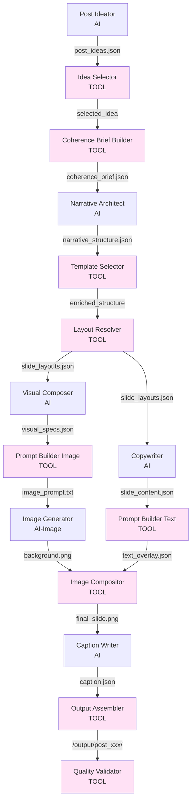

# Arquitetura: Ferramentas (Tools)

> **Versão**: 2.1  
> **Data**: 2026-01-14  
> **Status**: Documentação de Ferramentas  
> **Autor**: Sistema de Documentação Automatizada

---

## Visão Geral

O pipeline utiliza **ferramentas de código** (não-LLM) para orquestrar lógica, fazer seleções baseadas em regras, e processar dados. Essas ferramentas complementam os agentes AI, seguindo o princípio **"Code Decides, AI Creates"**.

### Princípio Fundamental

**Código decide consistência e lógica; AI cria conteúdo criativo.**

| Código Decide | AI Cria |
|---------------|---------|
| Seleção de paleta/tipografia | Post ideas / narrative arcs |
| Posições de layout | Copy / visual descriptions |
| Composição de slides | Hooks / CTAs |
| Seleção de templates | Conteúdo textual |

---

## Ferramentas do Pipeline

### 1. Idea Selector (Phase 1)

**Responsabilidade**: Filtrar/selecionar ideias geradas pelo Post Ideator.

**Localização**: `src/phases/phase1_ideation.py` (assumido)

**Inputs**:
- `post_ideas.json` (todas as ideias geradas)
- `filter_config` (configuração de filtros opcionais)

**Outputs**:
- `filtered_ideas.json` (ideias selecionadas)

**Lógica**:
- Filtro automático: seleciona top N ideias por confidence
- Filtro manual: permite seleção interativa
- Validação: ≥3 ideias? Distintas?

**Exemplo**:
```python
def filter_ideas(ideas: List[Dict], max_ideas: int = 6) -> List[Dict]:
    """Seleciona top N ideias por confidence"""
    sorted_ideas = sorted(ideas, key=lambda x: x.get("confidence", 0), reverse=True)
    return sorted_ideas[:max_ideas]
```

---

### 2. Coherence Brief Builder (Phase 2)

**Responsabilidade**: Construir brief inicial de coerência a partir de uma ideia selecionada.

**Localização**: `src/coherence/builder.py`

**Inputs**:
- `selected_idea` (ideia selecionada)
- `article_summary` (resumo do artigo)
- `libraries/` (paletas, tipografia, layouts)

**Outputs**:
- `coherence_brief.json` (brief inicial da Phase 1)

**Lógica**:
- Extrai campos da ideia: `platform`, `tone`, `persona`, `angle`, `hook`
- Seleciona paleta baseado em `platform` + `tone`
- Seleciona tipografia baseado em `platform` + `tone`
- Filtra insights usados da ideia
- Define canvas baseado em `platform`

**Exemplo de Seleção**:
```python
def select_palette(platform: str, tone: str) -> str:
    """Seleciona paleta baseado em platform e tone"""
    if platform == "linkedin" and tone == "professional":
        return "dark_professional_01"
    elif platform == "instagram" and tone == "casual":
        return "vibrant_casual_02"
    # ... mais regras
    return "default_palette"
```

**Campos Criados**:
- `metadata` (post_id, idea_id, platform, format)
- `voice` (tone, personality_traits, vocabulary_level, formality)
- `visual` (palette_id, palette, typography_id, typography, style, mood, canvas)
- `emotions` (primary, secondary, avoid, target)
- `content` (keywords, themes, main_message, value_proposition, angle, hook)
- `audience` (persona, pain_points, desires)
- `constraints` (avoid_topics, required_elements)
- `structure` (objective, narrative_arc, estimated_slides)
- `context` (article_context, key_insights_used, key_insights_content)
- `brand` (values, assets)

---

### 3. Parameter Resolver (Phase 2)

**Responsabilidade**: Resolver parâmetros do post (paleta, tipografia, canvas) a partir de libraries.

**Localização**: `src/phases/phase2_configuration.py` (assumido)

**Inputs**:
- `selected_idea` (ideia selecionada)
- `libraries/` (paletas, tipografia, layouts)

**Outputs**:
- `post_config.json` (configuração completa do post)

**Lógica**:
- Seleciona paleta de `libraries/palettes/`
- Seleciona tipografia de `libraries/typography/`
- Define canvas baseado em `platform`
- Resolve brand assets

**Exemplo**:
```json
{
  "post_id": "post_001",
  "idea_ref": "idea_1",
  "platform": "linkedin",
  "tone": "professional",
  "palette_id": "dark_professional_01",
  "typography_id": "inter_clean",
  "canvas": {"width": 1080, "height": 1350},
  "brand": {"handle": "@syntropy"}
}
```

---

### 4. Template Selector (Post-Phase 3)

**Responsabilidade**: Selecionar `template_id` específico por slide usando análise semântica.

**Localização**: `src/templates/selector.py`

**Inputs**:
- `narrative_structure.json` (com `template_type` e `value_subtype` por slide)
- `template_library` (46 templates pré-definidos)

**Outputs**:
- `narrative_structure_enriched.json` (com `template_id`, `template_justification`, `template_confidence` por slide)

**Tecnologia**:
- **Primário**: Análise semântica com embeddings (`sentence-transformers`)
  - Modelo: `all-MiniLM-L6-v2` (384 dimensões)
  - Pre-computa embeddings de todos os templates (inicialização: ~2-3s)
  - Compara slide description com templates via cosine similarity
  - **91% de precisão**
- **Fallback**: Keyword matching + Jaccard similarity (se embeddings não disponíveis)
  - **68% de precisão**

**Processo**:
1. Mapeia `template_type` + `value_subtype` para `module_type` (hook, valor_dado, valor_insight, etc.)
2. Filtra templates candidatos por `module_type`
3. Constrói descrição do slide: `purpose` + `copy_direction` + `key_elements`
4. Gera embedding da descrição
5. Compara com embeddings pré-computados dos templates
6. Seleciona template com maior cosine similarity
7. Adiciona `template_id`, `justification`, `confidence` ao slide

**Exemplo**:
```python
selector = TemplateSelector()

template_id, justification, confidence = selector.select_template(
    template_type="value",
    value_subtype="data",
    purpose="Present quantified evidence",
    copy_direction="Show statistics with credible source like McKinsey",
    key_elements=["statistics", "unused knowledge"],
    persona="Tech leaders",
    tone="professional",
    platform="linkedin"
)
# Retorna: ("VD_FONTE", "Semantic Analysis | Professional tone...", 0.87)
```

**Performance**:
- Inicialização: ~2-3 segundos (pre-compute embeddings, uma vez por processo)
- Por slide: ~100ms (análise semântica) ou ~5ms (fallback keyword)
- Total para 7 slides: ~700ms (com embeddings) ou ~35ms (fallback)

**Integração**:
- Usado após Narrative Architect (Phase 3)
- Enriquece `narrative_structure` antes de passar para Copywriter (Phase 4)

---

### 5. Layout Resolver (Phase 3)

**Responsabilidade**: Atribuir layouts por slide a partir da library de layouts.

**Localização**: `src/phases/phase3_post_creation.py` (assumido)

**Inputs**:
- `narrative_structure_enriched.json` (estrutura com `template_id` por slide)
- `libraries/layouts/` (layouts pré-definidos)

**Outputs**:
- `slide_layouts.json` (layout atribuído por slide)

**Lógica**:
- Seleciona layout baseado em `template_type` e `template_id`
- Considera `content_slots` definidos pelo Narrative Architect
- Respeita constraints do canvas

**Exemplo**:
```python
def resolve_layout(slide: Dict, template: TextualTemplate) -> Dict:
    """Resolve layout para um slide baseado no template"""
    layout_id = template.default_layout_id  # Template pode ter layout padrão
    # Ou seleciona baseado em content_slots
    if "headline" in slide["content_slots"] and "body" in slide["content_slots"]:
        layout_id = "two_column_headline_body"
    return load_layout(layout_id)
```

---

### 6. Prompt Builder (Image) (Phase 4)

**Responsabilidade**: Construir prompt para geração de imagem de fundo.

**Localização**: `src/phases/phase4_slide_generation.py` (assumido)

**Inputs**:
- `visual_specs.json` (especificações visuais do Visual Composer)
- `post_config.json` (configuração do post)

**Outputs**:
- `image_prompt.txt` (prompt para DALL-E 3 ou similar)

**Lógica**:
- Combina `visual_specs` (background, elements) com `post_config` (palette, style)
- Gera prompt descritivo para AI de imagem
- **NÃO inclui texto** (texto é adicionado depois pelo Image Compositor)

**Exemplo**:
```python
def build_image_prompt(visual_specs: Dict, post_config: Dict) -> str:
    """Constrói prompt para geração de imagem"""
    background = visual_specs["background"]
    palette = post_config["palette"]
    
    prompt = f"""
    Create a {background['type']} background with colors {palette['primary']} and {palette['accent']}.
    Style: {post_config['visual_style']}, Mood: {post_config['visual_mood']}.
    No text, no words, abstract design only.
    """
    return prompt
```

---

### 7. Image Generator (Phase 4)

**Responsabilidade**: Gerar imagem de fundo usando AI de imagem.

**Localização**: `src/phases/phase4_slide_generation.py` (assumido)

**Inputs**:
- `image_prompt.txt` (prompt construído)

**Outputs**:
- `background.png` (imagem de fundo)

**Tecnologia**:
- DALL-E 3 (ou similar)
- Gera apenas background (sem texto)

---

### 8. Prompt Builder (Text) (Phase 4)

**Responsabilidade**: Construir especificações de renderização de texto.

**Localização**: `src/phases/phase4_slide_generation.py` (assumido)

**Inputs**:
- `slide_content.json` (texto gerado pelo Copywriter)
- `slide_layout` (layout atribuído)

**Outputs**:
- `text_overlay.json` (especificações de posição, fonte, cor, ênfase)

**Lógica**:
- Mapeia `slide_content` para posições do `slide_layout`
- Aplica tipografia do brief
- Define cores de ênfase baseado em `emphasis[]` do Copywriter

**Exemplo**:
```json
{
  "slide_number": 1,
  "texts": [
    {
      "slot": "headline",
      "content": "85% Fail",
      "position": {"x": 540, "y": 200},
      "font": "Inter Bold",
      "size": 72,
      "color": "#FFFFFF",
      "emphasis": [
        {"text": "85%", "color": "#FF6B6B"},
        {"text": "Fail", "color": "#FF6B6B"}
      ]
    }
  ]
}
```

---

### 9. Image Compositor (Phase 4)

**Responsabilidade**: Combinar background + elementos + texto em slide final.

**Localização**: `src/phases/phase4_slide_generation.py` (assumido)

**Inputs**:
- `background.png` (imagem de fundo)
- `text_overlay.json` (especificações de texto)
- `visual_specs.json` (elementos visuais)
- `brand_assets` (assets da marca)

**Outputs**:
- `final_slide.png` (slide completo)

**Tecnologia**:
- Pillow (PIL) para composição de imagens
- Renderiza texto com tipografia especificada
- Aplica elementos visuais (glows, shapes, etc.)
- Adiciona brand assets (logo, etc.)

**Processo**:
1. Carrega `background.png`
2. Renderiza elementos visuais (`visual_specs.elements`)
3. Renderiza texto (`text_overlay.texts`) com tipografia e cores
4. Aplica ênfase (cores diferentes para palavras destacadas)
5. Adiciona brand assets (logo, handle)
6. Salva `final_slide.png`

---

### 10. Output Assembler (Phase 5)

**Responsabilidade**: Empacotar todos os outputs do post.

**Localização**: `src/phases/phase5_finalization.py` (assumido)

**Inputs**:
- Todos os slides (`final_slide.png` por slide)
- `caption.json` (legenda)
- `coherence_brief.json` (brief completo)
- `post_config.json` (configuração)

**Outputs**:
- `/output/post_xxx/` (diretório com todos os arquivos)

**Estrutura de Output**:
```
output/
  post_001/
    slides/
      slide_01.png
      slide_02.png
      ...
      slide_07.png
    caption.json
    coherence_brief.json
    post_config.json
    narrative_structure.json
```

---

### 11. Quality Validator (Phase 5)

**Responsabilidade**: Validar e pontuar qualidade do post gerado.

**Localização**: `src/phases/phase5_finalization.py` (assumido)

**Inputs**:
- Todos os outputs do post

**Outputs**:
- `validation_report.json` (relatório de validação)

**Validações**:
- **Coerência**: Texto segue brief? Visual segue paleta?
- **Completude**: Todos os slides gerados? Caption presente?
- **Qualidade Visual**: Dimensões corretas? Texto legível?
- **Qualidade Textual**: Texto dentro dos limites? Segue templates?

**Exemplo de Output**:
```json
{
  "post_id": "post_001",
  "score": 0.85,
  "breakdown": {
    "coherence": 0.9,
    "visual": 0.8,
    "textual": 0.85,
    "completeness": 1.0
  },
  "passed": true,
  "warnings": [
    "Slide 3: Text slightly exceeds recommended length"
  ]
}
```

---

## Fluxo de Ferramentas



---

## Design Libraries

As ferramentas selecionam de **libraries pré-validadas**:

### Palettes Library
**Localização**: `libraries/palettes/`

**Estrutura**:
```json
{
  "dark_professional_01": {
    "theme": "dark",
    "primary": "#000000",
    "accent": "#0060FF",
    "cta": "#FF6B6B",
    "background": "#0A0A0A",
    "text": "#FFFFFF"
  }
}
```

**Seleção**: Baseado em `platform` + `tone`

### Typography Library
**Localização**: `libraries/typography/`

**Estrutura**:
```json
{
  "inter_clean": {
    "heading_font": "Inter Bold",
    "body_font": "Inter Regular",
    "sizes": {"heading": 72, "body": 24}
  }
}
```

**Seleção**: Baseado em `platform` + `tone`

### Layouts Library
**Localização**: `libraries/layouts/`

**Estrutura**:
```json
{
  "centered_headline": {
    "slots": [
      {"name": "headline", "position": {"x": 540, "y": 400}, "max_chars": 60}
    ]
  }
}
```

**Seleção**: Baseado em `template_id` e `content_slots`

---

## Princípios de Design das Ferramentas

### 1. Determinismo

Ferramentas são **determinísticas**: mesma entrada → mesma saída.

### 2. Seleção Baseada em Regras

Ferramentas usam regras explícitas (não LLM) para seleções:
- Paleta: `if platform == "linkedin" and tone == "professional" → "dark_professional_01"`
- Template: Análise semântica (embeddings) com fallback para keywords

### 3. Validação Rigorosa

Cada ferramenta valida seus outputs:
- Coherence Brief Builder: Valida campos obrigatórios
- Template Selector: Valida confidence >0.5
- Image Compositor: Valida dimensões e legibilidade

### 4. Extensibilidade

Fácil adicionar novas:
- Templates: Adicionar em `textual_templates.py` → automaticamente integrado
- Paletas: Adicionar em `libraries/palettes/` → automaticamente disponível
- Layouts: Adicionar em `libraries/layouts/` → automaticamente selecionável

---

## Referências

- **Código das Ferramentas**:
  - `src/coherence/builder.py` - Coherence Brief Builder
  - `src/templates/selector.py` - Template Selector
  - `src/templates/library.py` - Template Library Manager
  - `src/templates/textual_templates.py` - 46 Template Definitions

- **Documentação Relacionada**:
  - `docs/architecture/agents.md` - Agentes AI
  - `docs/architecture/memory_management.md` - Coherence Brief
  - `docs/architecture/data_structures.md` - Estruturas de dados
  - `docs/SEMANTIC_TEMPLATE_SELECTION.md` - Seleção semântica de templates
