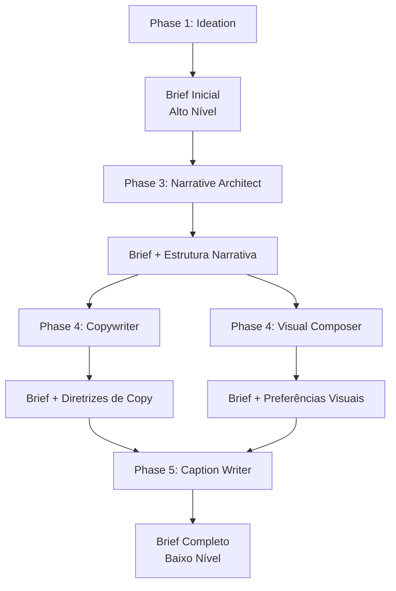

# Análise do Coherence Brief: Visão Evolutiva

## Princípio Fundamental

O **Coherence Brief é um documento dinâmico e evolutivo**, não estático. Ele começa com informações de alto nível na Phase 1 e é enriquecido por cada fase subsequente conforme os agentes especializados geram informações mais detalhadas.

## Fluxo Evolutivo do Coherence Brief



## Análise por Fase

### Phase 1: Brief Inicial (Alto Nível)

**Responsabilidade**: Estabelecer contexto estratégico e diretrizes de alto nível.

**Campos Necessários (já presentes)**:
- ✅ **VOICE**: tone, personality_traits, vocabulary_level, formality
- ✅ **VISUAL**: palette_id, palette, typography_id, typography, visual_style, visual_mood, canvas
- ✅ **EMOTIONS**: primary_emotion, secondary_emotions, avoid_emotions, target_emotions
- ✅ **CONTENT**: keywords_to_emphasize, themes, main_message, value_proposition, angle, hook
- ✅ **AUDIENCE**: persona, pain_points, desires
- ✅ **CONSTRAINTS**: avoid_topics, required_elements
- ✅ **STRUCTURE**: objective, narrative_arc (alto nível), estimated_slides
- ✅ **CONTEXT**: article_context, key_insights_used
- ✅ **BRAND**: brand_values

**Campos Adicionais Necessários**:
- ✅ **`key_insights_content`**: Lista completa dos insights usados (necessário para referência nas fases seguintes)
- ✅ **`brand_assets`**: Handle e assets básicos (necessário para renderização)

**Campos NÃO necessários aqui** (serão adicionados depois):
- ❌ `narrative_pacing` → Adicionado por Narrative Architect
- ❌ `visual_preferences` detalhadas → Adicionado por Visual Composer
- ❌ `cta_guidelines` detalhadas → Adicionado por Copywriter
- ❌ `platform_constraints` detalhadas → Adicionado por Caption Writer

---

### Phase 3: Narrative Architect → Adiciona ao Brief

**Responsabilidade**: Gerar estrutura narrativa detalhada slide por slide.

**O que adiciona ao Brief**:
```python
narrative_structure: Dict[str, Any] = {
    "pacing": "moderate",  # "fast", "moderate", "deliberate"
    "transition_style": "smooth",  # "abrupt", "smooth", "dramatic"
    "slides": [
        {
            "number": 1,
            "module": "hook",
            "purpose": "Grab attention with stat",
            "emotions": ["shock"],
            "content_slots": {"headline": {"max_chars": 60}},
            "visual_mood": "dramatic",
            "narrative_role": "opening"
        },
        # ... mais slides
    ]
}
```

**Método sugerido**:
```python
def enrich_from_narrative_structure(
    self, 
    narrative_structure: Dict[str, Any]
) -> None:
    """Enriquece o brief com informações da estrutura narrativa"""
    self.narrative_pacing = narrative_structure.get("pacing", "moderate")
    self.transition_style = narrative_structure.get("transition_style", "smooth")
    self.narrative_structure = narrative_structure  # Estrutura completa
```

---

### Phase 4: Copywriter → Adiciona ao Brief

**Responsabilidade**: Gerar texto para cada slide.

**O que adiciona ao Brief**:
```python
copy_guidelines: Dict[str, Any] = {
    "cta_details": {
        "type": "soft",  # "hard", "soft", "none"
        "position": "final_slide",
        "tone": "invitational",
        "suggested_text": "Learn more about...",
        "rationale": "Soft CTA aligns with professional tone"
    },
    "writing_patterns": {
        "headline_style": "statistic_led",  # "question_led", "statement_led"
        "body_style": "conversational_professional",
        "emphasis_technique": "bold_keywords"
    },
    "content_adaptations": {
        "simplified_for_visual": True,
        "key_points_per_slide": 1
    }
}
```

**Método sugerido**:
```python
def enrich_from_copywriting(
    self,
    copy_guidelines: Dict[str, Any]
) -> None:
    """Enriquece o brief com diretrizes de copywriting"""
    self.cta_guidelines = copy_guidelines.get("cta_details", {})
    self.copy_guidelines = copy_guidelines
```

---

### Phase 4: Visual Composer → Adiciona ao Brief (Paralelo)

**Responsabilidade**: Gerar especificações visuais para cada slide.

**O que adiciona ao Brief**:
```python
visual_preferences: Dict[str, Any] = {
    "layout_style": "centered",  # "asymmetric", "grid"
    "text_hierarchy": "bold_headlines",
    "image_style": "abstract",  # "photographic", "illustrated"
    "element_density": "moderate",  # "minimal", "rich"
    "emphasis_technique": "color_contrast",  # "size", "position"
    "composition_rules": {
        "rule_of_thirds": False,
        "centered_focus": True,
        "negative_space": "generous"
    }
}
```

**Método sugerido**:
```python
def enrich_from_visual_composition(
    self,
    visual_preferences: Dict[str, Any]
) -> None:
    """Enriquece o brief com preferências visuais"""
    self.visual_preferences = visual_preferences
```

**Nota**: Visual Composer e Copywriter podem trabalhar em paralelo, ambos lendo o brief inicial + estrutura narrativa.

---

### Phase 5: Caption Writer → Adiciona ao Brief

**Responsabilidade**: Gerar legenda específica da plataforma.

**O que adiciona ao Brief**:
```python
platform_constraints: Dict[str, Any] = {
    "max_caption_length": 3000,  # LinkedIn
    "hashtag_count": 3,
    "hashtag_style": "professional",  # "trendy", "minimal"
    "cta_format": "professional",
    "mention_style": "formal",
    "link_placement": "end",
    "caption_structure": {
        "hook_length": 150,
        "body_length": 2000,
        "cta_length": 100
    }
}
```

**Método sugerido**:
```python
def enrich_from_caption_writing(
    self,
    platform_constraints: Dict[str, Any]
) -> None:
    """Enriquece o brief com constraints da plataforma"""
    self.platform_constraints = platform_constraints
```

---

## Estrutura do Coherence Brief Evolutivo

### Campos Iniciais (Phase 1)

```python
@dataclass
class CoherenceBrief:
    # ... campos existentes ...
    
    # NOVOS campos iniciais
    key_insights_content: List[Dict[str, Any]] = field(default_factory=list)
    brand_assets: Dict[str, str] = field(default_factory=dict)
    
    # Campos que serão preenchidos por fases posteriores
    narrative_structure: Optional[Dict[str, Any]] = None
    narrative_pacing: Optional[str] = None
    transition_style: Optional[str] = None
    copy_guidelines: Optional[Dict[str, Any]] = None
    cta_guidelines: Optional[Dict[str, Any]] = None
    visual_preferences: Optional[Dict[str, Any]] = None
    platform_constraints: Optional[Dict[str, Any]] = None
```

### Métodos de Enriquecimento

```python
def enrich_from_narrative_structure(self, narrative_structure: Dict[str, Any]) -> None:
    """Enriquece com estrutura narrativa detalhada"""
    
def enrich_from_copywriting(self, copy_guidelines: Dict[str, Any]) -> None:
    """Enriquece com diretrizes de copywriting"""
    
def enrich_from_visual_composition(self, visual_preferences: Dict[str, Any]) -> None:
    """Enriquece com preferências visuais"""
    
def enrich_from_caption_writing(self, platform_constraints: Dict[str, Any]) -> None:
    """Enriquece com constraints da plataforma"""
```

### Métodos de Contexto por Fase

```python
def to_narrative_architect_context(self) -> str:
    """Contexto para Narrative Architect (usa apenas campos iniciais)"""
    # voice, emotions, content, structure (alto nível)
    
def to_copywriter_context(self) -> str:
    """Contexto para Copywriter (usa brief inicial + narrative_structure)"""
    # voice, content, audience, narrative_structure, key_insights_content
    
def to_visual_composer_context(self) -> str:
    """Contexto para Visual Composer (usa brief inicial + narrative_structure)"""
    # visual, emotions, narrative_structure, canvas
    
def to_caption_writer_context(self) -> str:
    """Contexto para Caption Writer (usa brief completo)"""
    # voice, platform, cta_guidelines, platform_constraints, brand_assets
```

---

## Implementação Sugerida

### Passo 1: Adicionar Campos ao CoherenceBrief

**Arquivo**: `src/coherence/brief.py`

Adicionar:
- Campos iniciais: `key_insights_content`, `brand_assets`
- Campos evolutivos: `narrative_structure`, `narrative_pacing`, `transition_style`, `copy_guidelines`, `cta_guidelines`, `visual_preferences`, `platform_constraints`

### Passo 2: Atualizar CoherenceBriefBuilder (Phase 1)

**Arquivo**: `src/coherence/builder.py`

Preencher apenas campos iniciais:
- `key_insights_content`: Filtrar `article_summary["key_insights"]` por `key_insights_used`
- `brand_assets`: Valores padrão ou configuráveis

### Passo 3: Criar Métodos de Enriquecimento

**Arquivo**: `src/coherence/brief.py`

Adicionar métodos `enrich_from_*()` para cada fase.

### Passo 4: Atualizar Fases para Enriquecer o Brief

**Arquivos**: `src/phases/phase3_narrative.py`, `src/phases/phase4_copywriting.py`, etc.

Cada fase deve:
1. Ler o brief atual
2. Gerar seu output
3. Chamar `brief.enrich_from_*()` com informações relevantes
4. Salvar o brief atualizado

### Passo 5: Métodos de Contexto Específicos

**Arquivo**: `src/coherence/brief.py`

Criar métodos `to_*_context()` que retornam apenas campos relevantes para cada fase.

---

## Exemplo de Fluxo Completo

### Phase 1: Brief Inicial
```python
brief = CoherenceBriefBuilder.build_from_idea(idea, article_summary, post_id)
# Contém: voice, visual, emotions, content, audience, structure (alto nível)
```

### Phase 3: Narrative Architect
```python
context = brief.to_narrative_architect_context()
narrative_structure = narrative_architect.generate(context, article_text)
brief.enrich_from_narrative_structure(narrative_structure)
# Brief agora contém: estrutura narrativa detalhada, pacing, transitions
```

### Phase 4: Copywriter (paralelo com Visual Composer)
```python
context = brief.to_copywriter_context()  # Inclui narrative_structure
slide_content = copywriter.generate(context, article_text, slide_layout)
copy_guidelines = extract_copy_guidelines(slide_content)
brief.enrich_from_copywriting(copy_guidelines)
# Brief agora contém: cta_guidelines, writing_patterns
```

### Phase 4: Visual Composer (paralelo com Copywriter)
```python
context = brief.to_visual_composer_context()  # Inclui narrative_structure
visual_specs = visual_composer.generate(context, slide_layout)
visual_preferences = extract_visual_preferences(visual_specs)
brief.enrich_from_visual_composition(visual_preferences)
# Brief agora contém: visual_preferences detalhadas
```

### Phase 5: Caption Writer
```python
context = brief.to_caption_writer_context()  # Brief completo
caption = caption_writer.generate(context, all_slide_contents)
platform_constraints = extract_platform_constraints(caption, platform)
brief.enrich_from_caption_writing(platform_constraints)
# Brief agora está completo
```

---

## Resumo: O que Adicionar Agora vs. Depois

### ✅ Adicionar na Phase 1 (Brief Inicial)

1. **`key_insights_content`** - Lista completa dos insights usados (necessário para referência)
2. **`brand_assets`** - Handle e assets básicos (necessário para renderização)

### ⏳ Adicionar nas Fases Posteriores

1. **`narrative_structure`** → Phase 3 (Narrative Architect)
2. **`narrative_pacing`, `transition_style`** → Phase 3 (Narrative Architect)
3. **`copy_guidelines`, `cta_guidelines`** → Phase 4 (Copywriter)
4. **`visual_preferences`** → Phase 4 (Visual Composer)
5. **`platform_constraints`** → Phase 5 (Caption Writer)

---

## Conclusão

O Coherence Brief deve ser **evolutivo**, começando com contexto estratégico de alto nível na Phase 1 e sendo enriquecido por cada fase especializada conforme informações mais detalhadas são geradas. Isso permite:

1. **Especialização**: Cada agente LLM foca em sua área de expertise
2. **Contexto Progressivo**: Cada fase tem acesso ao contexto necessário sem sobrecarga
3. **Flexibilidade**: O brief pode evoluir conforme necessário
4. **Rastreabilidade**: Histórico completo de decisões em cada fase

A implementação na Phase 1 deve focar apenas em estabelecer o **brief inicial** com contexto estratégico, deixando os detalhes operacionais para as fases especializadas.
