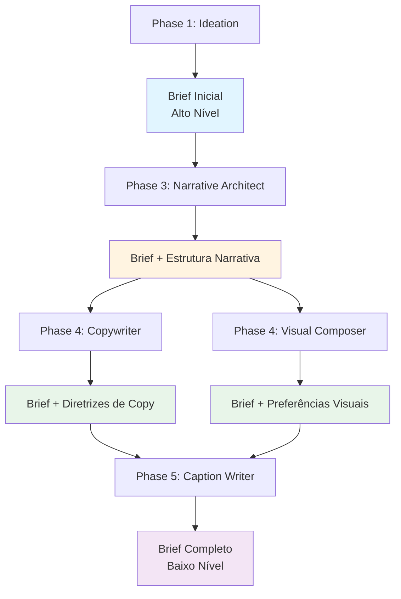
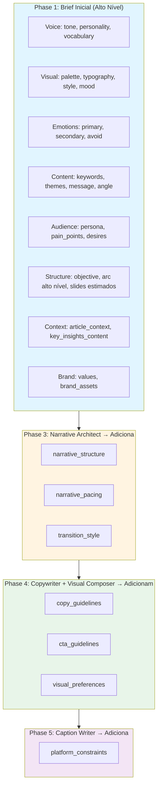

# Social Media Post Generation Pipeline - English.md

> **Version**: 2.0  
> **Date**: 2025-12-08  
> **Status**: Simplified Architecture  
> **Author**: José Scott (Revised)

---

## Summary

- [[#Overview]]
    
- [[#Design Principles]]
    
- [[#System Architecture]]
    
- [[#Data Flow]]
    
- [[#Detailed Components]]
    
- [[#Coherence System]]
    
- [[#Design Libraries]]
    
- [[#Prompt Strategy]]
    
- [[#Validation and Quality]]
    
- [[#Implementation Considerations]]

---

## Overview

### Problem

Generating high-quality social media posts from articles requires balancing content analysis, ideation, configuration, narrative structure, slide generation, and finalization. The original design was over-engineered with redundant analysis phases and global assumptions about platform/tone. A simplified pipeline focuses on modularity, per-post customization, and clear responsibilities.

### Solution

A streamlined, 5-phase pipeline orchestrated by Python code:

- **Specialized prompts**: Each AI call focuses on one task.
    
- **Design libraries**: Pre-validated visuals (palettes, layouts, typography).
    
- **Coherence context**: Per-post document ensuring consistency.
    
- **Validation gates**: Quality checks per phase.

One article inputs generate multiple posts, each with its own platform, tone, persona, etc., and 1–12 slides + caption.

### Objectives

|Objective|Success Metric|
|---|---|
|Consistent quality|Posts adhere to design libraries and coherence|
|Per-post flexibility|Each post has unique platform/tone/persona|
|Autonomy|Minimal user input (article only)|
|Scalability|Parallel post/slide generation|
|Debuggability|Isolatable phases|

---

## Design Principles

### 1. Single Responsibility Prompts

Each prompt handles one task:

```text
✅ Prompt 1: "From article, generate 3–6 post ideas with per-post platform/tone"
          Prompt 2: "For selected idea, build narrative skeleton by slide"
          Prompt 3: "Write copy for one slide's text slots"
```

### 2. Code Decides, AI Creates

Code handles consistency:

|Code Decides|AI Creates|
|---|---|
|Palette/typography selection|Post ideas/narrative arcs|
|Layout positions|Copy/visual descriptions|
|Slide composition|Hooks/CTAs|

### 3. Per-Post Context

Each post gets tailored context (platform, tone, etc.) from ideation onward. No global assumptions.

### 4. Coherence Through Constraint

- **Coherence Brief**: Per-post JSON traveling through phases.
    
- **Libraries**: LLM selects from options, doesn't invent.
    
- **Gates**: Validate before advancing.

### 5. Graceful Defaults

Input: Article only. System auto-suggests/assigns per-post params.

---

## System Architecture

### High-Level Diagram

```text
┌─────────────────────────────────────────────────────────────────────────────┐
│                              USER INPUT                                     │
│  ┌─────────────┐                                                            │
│  │   Article   │  (required; generates multiple posts)                      │
│  └─────────────┘                                                            │
└────────────────────────────────────┬────────────────────────────────────────┘
                                     │
                                     ▼
┌─────────────────────────────────────────────────────────────────────────────┐
│                          PHASE 1: IDEATION                                  │
│  ┌─────────────────────────────────────────────────────────────────────┐    │
│  │  [AI] Post Ideator                                                  │    │
│  │  Analyzes article + generates 3–6 ideas (per-post platform/tone)    │    │
│  └─────────────────────────────────────────────────────────────────────┘    │
│                                     │                                       │
│                                     ▼                                       │
│  ┌─────────────────────────────────────────────────────────────────────┐    │
│  │  [CODE/USER] Idea Selector                                          │    │
│  │  Selects top N ideas (auto or manual)                               │    │
│  └─────────────────────────────────────────────────────────────────────┘    │
└────────────────────────────────────┬────────────────────────────────────────┘
                                     │
                                     ▼
┌─────────────────────────────────────────────────────────────────────────────┐
│                         PHASE 2: CONFIGURATION                              │
│  (Loop for each selected idea → post)                                       │
│  ┌─────────────────────────────────────────────────────────────────────┐    │
│  │  [CODE] Parameter Resolver                                          │    │
│  │  Assigns palette, typography, etc. from libraries                   │    │
│  └─────────────────────────────────────────────────────────────────────┘    │
│                                     │                                       │
│                                     ▼                                       │
│  ┌─────────────────────────────────────────────────────────────────────┐    │
│  │  [CODE] Coherence Brief Builder                                     │    │
│  │  Builds per-post coherence document                                 │    │
│  └─────────────────────────────────────────────────────────────────────┘    │
└────────────────────────────────────┬────────────────────────────────────────┘
                                     │
                                     ▼
┌─────────────────────────────────────────────────────────────────────────────┐
│                          PHASE 3: POST CREATION                             │
│  ┌─────────────────────────────────────────────────────────────────────┐    │
│  │  [AI] Narrative Architect                                           │    │
│  │  Builds skeleton: slide-by-slide structure (Hook → CTA)             │    │
│  │  Defines n_slides, purposes, emotions per slide                     │    │
│  └─────────────────────────────────────────────────────────────────────┘    │
│                                     │                                       │
│                                     ▼                                       │
│  ┌─────────────────────────────────────────────────────────────────────┐    │
│  │  [CODE] Layout Resolver                                             │    │
│  │  Assigns layouts per slide from library                             │    │
│  └─────────────────────────────────────────────────────────────────────┘    │
└────────────────────────────────────┬────────────────────────────────────────┘
                                     │
                                     ▼
┌─────────────────────────────────────────────────────────────────────────────┐
│                          PHASE 4: SLIDE GENERATION                          │
│  (Loop for each slide)                                                      │
│                                                                             │
│  ┌──────────────────────┐        ┌────────────────────────┐                 │
│  │ [AI] Copywriter      │        │ [AI] Visual Composer   │                 │
│  │ Generates text       │        │ Generates design       │                 │
│  │ structure per slot   │        │ (bg, elements, no text)│                 │
│  └────────┬─────────────┘        └────────┬───────────────┘                 │
│           │                               │                                 │
│           ▼                               ▼                                 │
│  ┌─────────────────┐          ┌─────────────────┐                           │
│  │ [CODE] Prompt   │          │ [CODE] Prompt   │                           │
│  │ Builder (text)  │          │ Builder (image) │                           │
│  └────────┬────────┘          └────────┬────────┘                           │
│           │                            │                                    │
│           │                            ▼                                    │
│           │                    ┌─────────────────┐                          │
│           │                    │ [AI-IMAGE]      │                          │
│           │                    │ Image Generator │                          │
│           │                    │ (background)    │                          │
│           │                    └────────┬────────┘                          │
│           │                             │                                   │
│           └───────────┬─────────────────┘                                   │
│                       │                                                     │
│                       ▼                                                     │
│              ┌─────────────────────────────────────┐                        │
│              │ [CODE] Image Compositor             │                        │
│              │ Combines: bg + elements + text      │                        │
│              └─────────────────┬───────────────────┘                        │
│                                │                                            │
│                                ▼                                            │
│                       final_slide.png                                       │
└─────────────────────────────────────────────────────────────────────────────┘
                                     │
                                     ▼
┌─────────────────────────────────────────────────────────────────────────────┐
│                          PHASE 5: FINALIZATION                              │
│  ┌─────────────────────────────────────────────────────────────────────┐    │
│  │  [AI] Caption Writer                                                │    │
│  │  Writes platform-specific caption                                   │    │
│  └─────────────────────────────────────────────────────────────────────┘    │
│                                     │                                       │
│                                     ▼                                       │
│  ┌─────────────────────────────────────────────────────────────────────┐    │
│  │  [CODE] Output Assembler                                            │    │
│  │  Packages slides + caption + elements                               │    │
│  └─────────────────────────────────────────────────────────────────────┘    │
│                                     │                                       │
│                                     ▼                                       │
│  ┌─────────────────────────────────────────────────────────────────────┐    │
│  │  [CODE] Quality Validator                                           │    │
│  │  Scores and reports                                                 │    │
│  └─────────────────────────────────────────────────────────────────────┘    │
└────────────────────────────────────┬────────────────────────────────────────┘
                                     │
                                     ▼
                              FINAL OUTPUT
                              (Multiple posts)
```

---

## Data Flow

### Coherence Brief Evolution Flow

```mermaid
flowchart LR
    subgraph Phase1["Phase 1: Ideation"]
        A1[Article] --> A2[IdeaGenerator]
        A2 --> A3[Ideas JSON]
        A3 --> A4{Idea Filter?}
        A4 -->|Yes| A5[Filtered Ideas]
        A4 -->|No| A5
        A5 --> A6[CoherenceBriefBuilder]
        A6 --> A7[Brief Inicial]
    end
    
    subgraph Phase3["Phase 3: Narrative"]
        A7 --> B1[Narrative Architect]
        B1 --> B2[Narrative Structure]
        B2 --> B3[enrich_from_narrative_structure]
        B3 --> B4[Brief + Narrative]
    end
    
    subgraph Phase4["Phase 4: Content Generation"]
        B4 --> C1[Copywriter]
        B4 --> C2[Visual Composer]
        C1 --> C3[Copy Guidelines]
        C2 --> C4[Visual Preferences]
        C3 --> C5[enrich_from_copywriting]
        C4 --> C6[enrich_from_visual_composition]
        C5 --> C7[Brief Completo Phase 4]
        C6 --> C7
    end
    
    subgraph Phase5["Phase 5: Finalization"]
        C7 --> D1[Caption Writer]
        D1 --> D2[Platform Constraints]
        D2 --> D3[enrich_from_caption_writing]
        D3 --> D4[Brief Final Completo]
    end
    
    style A7 fill:#e1f5ff
    style B4 fill:#fff4e1
    style C7 fill:#e8f5e9
    style D4 fill:#f3e5f5
```



### Component Table

|#|Component|Type|Inputs|Outputs|Responsibility|
|---|---|---|---|---|---|
|0|User Input|Manual|Article|`article.txt`|Single required input|
|1|Post Ideator|AI|`article.txt`|`post_ideas.json`|Analyze + ideate 3–6 per-post ideas|
|2|Idea Filter|Code|`post_ideas.json`, `filter_config`|`filtered_ideas.json`|Filter/select ideas (optional)|
|3|Coherence Brief Builder|Code|`filtered_idea`, `article_summary`, `libraries/`|`coherence_brief.json` (initial)|Per-post initial brief (Phase 1)|
|4|Narrative Architect|AI|`coherence_brief.json`, `article.txt`|`narrative_structure.json`|Slide-by-slide skeleton + enrich brief|
|5|Parameter Resolver|Code|`selected_idea`, `libraries/`|`post_config.json`|Per-post params (palette, etc.)|
|6|Layout Resolver|Code|`narrative_structure.json`, `libraries/layouts`|`slide_layouts.json`|Per-slide layouts|
|7|Copywriter|AI|`slide_layout`, `coherence_brief.json`, `article.txt`|`slide_content.json` + enrich brief|Text per slot + enrich brief|
|8|Visual Composer|AI|`slide_layout`, `post_config.json`, `coherence_brief.json`|`visual_specs.json` + enrich brief|Design (no text) + enrich brief|
|9|Prompt Builder (Image)|Code|`visual_specs.json`, `post_config.json`|`image_prompt.txt`|Image gen prompt|
|10|Image Generator|AI-Image|`image_prompt.txt`|`background.png`|Background image|
|11|Prompt Builder (Text)|Code|`slide_content.json`, `slide_layout`|`text_overlay.json`|Text rendering specs|
|12|Image Compositor|Code|`background.png`, `text_overlay.json`, `brand_assets`|`final_slide.png`|Combine elements|
|13|Caption Writer|AI|`post_config.json`, `all_slide_contents`, `coherence_brief.json`|`caption.json` + enrich brief|Per-post caption + enrich brief|
|14|Output Assembler|Code|All slides, `caption.json`|`/output/post_xxx/`|Package per post|
|15|Quality Validator|Code|All outputs|`validation_report.json`|Per-post scoring|

### Main Data Structures

#### post_ideas.json (New: Combines analysis + ideation)

```json
{
  "ideas": [
    {
      "id": "idea_1",
      "platform": "linkedin",
      "tone": "professional",
      "persona": "C-level execs",
      "angle": "AI failure patterns",
      "hook": "85% of AI projects fail—here's why",
      "narrative_arc": "Hook → Problem → Solution → CTA",
      "key_insights_used": ["insight_1", "insight_2"],
      "estimated_slides": 7,
      "confidence": 0.9
    }
  ],
  "article_summary": {
    "main_thesis": "string",
    "key_insights": [{"id": "string", "content": "string"}],
    "themes": ["string"]
  }
}
```

#### post_config.json (Per-post)

```json
{
  "post_id": "post_001",
  "idea_ref": "idea_1",
  "platform": "linkedin",
  "tone": "professional",
  "persona": "C-level execs",
  "palette_id": "dark_professional_01",
  "typography_id": "inter_clean",
  "canvas": {"width": 1080, "height": 1350},
  "brand": {"handle": "string"}
}
```

#### coherence_brief.json (Per-post, Evolutivo)

**Brief Inicial (Phase 1)**:
```json
{
  "metadata": {
    "post_id": "post_article_slug_idea_1",
    "idea_id": "idea_1",
    "platform": "linkedin",
    "format": "carousel"
  },
  "voice": {
    "tone": "professional",
    "personality_traits": ["authoritative", "insightful"],
    "vocabulary_level": "sophisticated",
    "formality": "formal"
  },
  "visual": {
    "palette_id": "brand_dark_professional",
    "palette": {"primary": "#000000", "accent": "#0060FF", "theme": "dark"},
    "typography_id": "brand_professional",
    "style": "clean_professional_data_focused",
    "mood": "dramatic_focused"
  },
  "emotions": {
    "primary": "urgency",
    "secondary": ["curiosity"],
    "avoid": ["fear"]
  },
  "content": {
    "keywords_to_emphasize": ["AI", "failure"],
    "themes": ["AI", "project management"],
    "main_message": "Organizational alignment is key to AI success",
    "angle": "Uncovering hidden organizational pitfalls",
    "hook": "Shocking: 85% of AI projects fail—but it's not the tech's fault"
  },
  "audience": {
    "persona": "Tech leaders and executives",
    "pain_points": ["wasted budgets", "project delays"],
    "desires": ["successful AI implementation", "competitive edge"]
  },
  "context": {
    "article_context": "The article highlights that 85% of AI projects fail...",
    "key_insights_used": ["insight_1", "insight_2"],
    "key_insights_content": [
      {
        "id": "insight_1",
        "content": "85% of AI projects fail primarily due to organizational misalignment",
        "type": "statistic",
        "strength": 10,
        "source_quote": "According to Gartner..."
      }
    ]
  },
  "brand": {
    "values": ["go_deep_or_go_home"],
    "assets": {
      "handle": "@syntropy",
      "tagline": "Go deep or go home"
    }
  },
  "evolution": {
    "narrative_structure": null,
    "narrative_pacing": null,
    "transition_style": null,
    "copy_guidelines": null,
    "cta_guidelines": null,
    "visual_preferences": null,
    "platform_constraints": null
  }
}
```

**Após Phase 3 (Narrative Architect)** - Campos adicionados:
```json
{
  "evolution": {
    "narrative_structure": {
      "pacing": "moderate",
      "transition_style": "smooth",
      "slides": [
        {
          "number": 1,
          "module": "hook",
          "purpose": "Grab attention with stat",
          "emotions": ["shock"],
          "content_slots": {"headline": {"max_chars": 60}}
        }
      ]
    },
    "narrative_pacing": "moderate",
    "transition_style": "smooth"
  }
}
```

**Após Phase 4 (Copywriter + Visual Composer)** - Campos adicionados:
```json
{
  "evolution": {
    "copy_guidelines": {
      "headline_style": "statistic_led",
      "body_style": "conversational_professional"
    },
    "cta_guidelines": {
      "type": "soft",
      "position": "final_slide",
      "tone": "invitational",
      "suggested_text": "Learn more about..."
    },
    "visual_preferences": {
      "layout_style": "centered",
      "text_hierarchy": "bold_headlines",
      "element_density": "moderate"
    }
  }
}
```

**Após Phase 5 (Caption Writer)** - Brief Completo:
```json
{
  "evolution": {
    "platform_constraints": {
      "max_caption_length": 3000,
      "hashtag_count": 3,
      "cta_format": "professional",
      "mention_style": "formal"
    }
  }
}
```

#### narrative_structure.json (Slide-by-slide skeleton)

```json
{
  "post_id": "post_001",
  "arc": "Hook → Problem → Value → CTA",
  "slides": [
    {
      "number": 1,
      "module": "hook",
      "purpose": "Grab attention with stat",
      "emotions": ["shock"],
      "content_slots": {"headline": {"max_chars": 60}},
      "visual_mood": "dramatic"
    },
    {
      "number": 2,
      "module": "transition",
      "purpose": "Bridge to problem",
      "emotions": ["curiosity"]
    }
    // ... up to n_slides
  ]
}
```

#### slide_content.json

```json
{
  "slide_number": 1,
  "texts": {
    "headline": {"content": "85% Fail", "emphasis": {"color": "#FF6B6B"}},
    "subheadline": {"content": "Here's why"}
  }
}
```

#### visual_specs.json (Design only)

```json
{
  "slide_number": 1,
  "background": {"type": "gradient", "colors": ["#1A1A2E", "#0A0A0A"]},
  "elements": [{"type": "glow", "position": {"x": 540, "y": 580}}]
}
```

#### caption.json (Per-post)

```json
{
  "platform": "linkedin",
  "full_caption": "string",
  "character_count": 1247,
  "hashtags": ["#AI"]
}
```

(Removed redundant structures like separate content_analysis.json, strategy_recommendations.json for simplification.)

---

## Coherence System

### Coherence Brief: Modelo Evolutivo

O **Coherence Brief é um documento dinâmico e evolutivo**, não estático. Ele começa com informações de alto nível na Phase 1 e é enriquecido por cada fase subsequente conforme os agentes especializados geram informações mais detalhadas.

#### Fluxo Evolutivo



#### Estrutura do Brief por Fase



### Coherence Brief Components

#### Brief Inicial (Phase 1)

```text
┌─────────────────────────────────────────────────────────────────┐
│                  COHERENCE BRIEF (INICIAL)                       │
├─────────────────────────────────────────────────────────────────┤
│                                                                 │
│  VOICE                          VISUAL                          │
│  ├─ tone                        ├─ palette_id                   │
│  ├─ personality_traits          ├─ palette (cores completas)    │
│  ├─ vocabulary_level            ├─ typography_id                │
│  └─ formality                   ├─ typography                   │
│                                 ├─ style                        │
│                                 └─ mood                         │
│                                                                 │
│  EMOTIONS                       CONTENT                         │
│  ├─ primary                     ├─ keywords_to_emphasize        │
│  ├─ secondary                   ├─ themes                       │
│  ├─ avoid                       ├─ main_message                 │
│  └─ target                      ├─ value_proposition            │
│                                 ├─ angle                        │
│                                 └─ hook                         │
│                                                                 │
│  AUDIENCE                       CONSTRAINTS                     │
│  ├─ persona                     ├─ avoid_topics                 │
│  ├─ pain_points                 └─ required_elements            │
│  └─ desires                                                     │
│                                                                 │
│  STRUCTURE                      CONTEXT                         │
│  ├─ objective                   ├─ article_context              │
│  ├─ narrative_arc (alto nível)   ├─ key_insights_used            │
│  └─ estimated_slides            └─ key_insights_content         │
│                                                                 │
│  BRAND                                                          │
│  ├─ values                      ├─ brand_assets                 │
│                                 │  └─ handle, tagline           │
└─────────────────────────────────────────────────────────────────┘
```

#### Campos Evolutivos (Adicionados por Fases Posteriores)

```text
┌─────────────────────────────────────────────────────────────────┐
│              CAMPOS EVOLUTIVOS (Phase 3-5)                      │
├─────────────────────────────────────────────────────────────────┤
│                                                                 │
│  Phase 3: Narrative Architect                                  │
│  ├─ narrative_structure (estrutura detalhada slide por slide)  │
│  ├─ narrative_pacing (fast/moderate/deliberate)                │
│  └─ transition_style (abrupt/smooth/dramatic)                  │
│                                                                 │
│  Phase 4: Copywriter                                           │
│  ├─ copy_guidelines (padrões de escrita)                       │
│  └─ cta_guidelines (detalhes de CTA)                           │
│                                                                 │
│  Phase 4: Visual Composer                                      │
│  └─ visual_preferences (preferências de layout/composição)     │
│                                                                 │
│  Phase 5: Caption Writer                                        │
│  └─ platform_constraints (limites e formatos da plataforma)    │
│                                                                 │
└─────────────────────────────────────────────────────────────────┘
```

### Coherence Brief (Per-Post)

**Criado na Phase 1**, evolui através das Phases 3–5. Garante consistência per-post em voice, visuals, etc.

|Component|Fields Used By|Purpose|Context Method|
|---|---|---|---|
|Post Ideator|N/A (pre-brief)|Initial alignment|N/A|
|Narrative Architect|voice, emotions, content, structure|Arc per slide|`to_narrative_architect_context()`|
|Copywriter|voice, content, audience, narrative_structure|Text tone|`to_copywriter_context()`|
|Visual Composer|visual, emotions, narrative_structure|Design mood|`to_visual_composer_context()`|
|Caption Writer|voice, platform, cta_guidelines, platform_constraints|Caption fit|`to_caption_writer_context()`|

#### Métodos de Enriquecimento

Cada fase adiciona informações ao brief usando métodos específicos:

- **Phase 3**: `brief.enrich_from_narrative_structure(narrative_structure)`
- **Phase 4 (Copywriter)**: `brief.enrich_from_copywriting(copy_guidelines)`
- **Phase 4 (Visual Composer)**: `brief.enrich_from_visual_composition(visual_preferences)`
- **Phase 5**: `brief.enrich_from_caption_writing(platform_constraints)`

#### Exemplo de Uso por Fase

**Narrative Architect (Phase 3)**:
```text
COHERENCE BRIEF (Narrative Architect):
- Tone: Professional
- Primary emotion: Urgency
- Keywords: AI, failure
- Persona: C-level execs
- Narrative Arc (high-level): Hook → Problem → Solution → CTA
- Estimated Slides: 7

TASK: Create detailed slide-by-slide narrative structure.
```

**Copywriter (Phase 4)**:
```text
COHERENCE BRIEF (Copywriter):
- Voice: Professional, sophisticated vocabulary, formal
- Content: Main message, keywords, angle
- Audience: Persona, pain points, desires
- Narrative Structure: [detailed structure from Phase 3]

TASK: Write headline for slide 1 (hook). Max 60 chars.
```

**Visual Composer (Phase 4)**:
```text
COHERENCE BRIEF (Visual Composer):
- Visual: Palette, typography, canvas, style, mood
- Emotions: Primary, secondary, avoid
- Narrative Structure: [pacing, transitions from Phase 3]

TASK: Generate visual specs for slide 1.
```

**Caption Writer (Phase 5)**:
```text
COHERENCE BRIEF (Caption Writer):
- Platform: LinkedIn
- Voice: Professional, formal
- CTA Guidelines: [from Copywriter]
- Platform Constraints: max_length=3000, hashtag_count=3

TASK: Write platform-specific caption.
```

---

## Design Libraries

(Unchanged structure, but selection now per-post in Phase 2 code.)

Libraries: palettes/, typography/, layouts/. Code selects based on post's platform/tone.

Example selection rule:

```python
def select_palette(post_config):
    if post_config["platform"] == "linkedin" and post_config["tone"] == "professional":
        return "dark_professional_01"
```

---

## Prompt Strategy

### Prompt Map (Simplified)

|Prompt|Input|Output|Context|
|---|---|---|---|
|Post Ideator|Article|Ideas + summary|None|
|Narrative Architect|Config + brief + article|Slide skeleton|Full brief|
|Copywriter|Layout + brief + article|Text JSON|Voice/emotions|
|Visual Composer|Layout + config + brief|Design JSON|Visual/emotions|
|Caption Writer|Config + slides + brief|Caption JSON|Voice/platform|

### Standard Structure

```text
[ROLE] e.g., "You are a narrative expert"

[CONTEXT] Relevant brief + inputs

[TASK] One clear action

[CONSTRAINTS] Limits/exclusions

[OUTPUT] JSON schema

[EXAMPLE] 1 concrete pair
```

Token estimates reduced: Ideation ~2500 in/~800 out; others ~500 in/~200 out.

---

## Validation and Quality

### Gates (Per-Phase)

- **Phase 1**: ≥3 ideas? Distinct?
- **Phase 2**: Config complete? Brief valid?
- **Phase 3**: ≥5 slides? Arc logical?
- **Phase 4**: Text in limits? Design no-text? Image dims correct?
- **Phase 5**: Caption length OK? Score >0.7?

Retry: 2 attempts with feedback; fallback to defaults.

### Quality Score (Per-Post)

```json
{
  "post_id": "post_001",
  "score": 0.85,
  "breakdown": {"coherence": 0.9, "visual": 0.8},
  "passed": true
}
```

---

## Implementation Considerations

### Tech Stack

|Component|Tech|Reason|
|---|---|---|
|Orchestrator|Python + asyncio|Parallel posts/slides|
|AI|OpenAI/Anthropic|Core generation|
|Image|DALL-E 3|P backgrounds|
|Compositor|Pillow|Overlays|

### Directory

```text
social-media-pipeline/
├── src/
│   ├── orchestrator.py
│   ├── phases/
│   │   ├── ideation.py
│   │   ├── configuration.py
│   │   ├── post_creation.py
│   │   ├── slide_generation.py
│   │   └── finalization.py
│   ├── utils/
│   │   ├── ai_client.py
│   │   └── validators.py
├── libraries/  # Unchanged
├── prompts/    # Simplified: 5 files
├── output/
└── config.yaml
```

### Performance/Costs

Parallel: Posts independent; slides parallel.

Costs per post (7 slides): ~15 calls, ~12k tokens, ~$0.50 (reduced from original).

### Modes

- **Auto**: Article → all posts.
- **Guided**: Select ideas/configs.

### Extensibility

Add: New modules/layouts in libs; new prompts/phases.

---

## Next Steps

### Phase 1: Ideation Core

- Implement Post Ideator prompt.
- Basic selector.

### Phase 2: Config + Skeleton

- Code resolvers/builders.
- Narrative Architect.

### Phase 3: Generation

- Parallel slide gen/composition.
- Image integration.

### Phase 4: Final + UI

- Caption/validation.
- CLI for input/output.

### Phase 5: Optimize

- Caching, metrics.

---

## References

- [[Prompts]] – Core 5 prompts.
- [[Libraries]] – Docs.
- [[Examples]] – Sample runs.

---

> **Note**: Simplified for clarity; focuses on per-post flow and reduced components. Changes reflected in all sections.